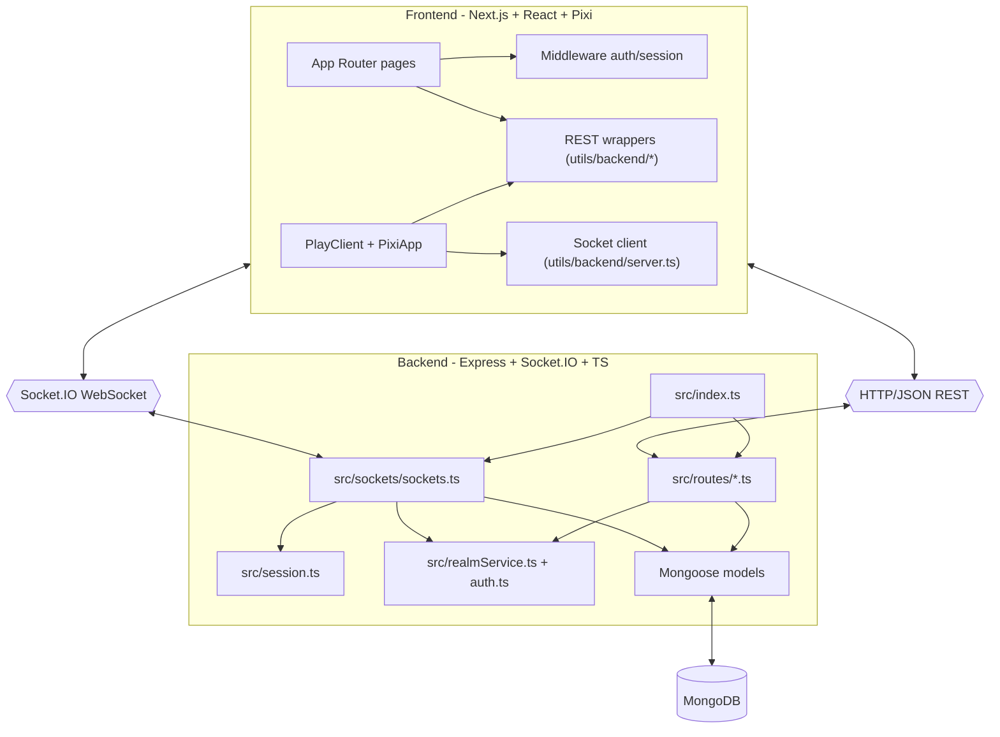

# Source Code Architecture Overview

> High-level blueprint of modules, folders, and runtime data flow in The Gathering.

This document maps how the current codebase is organized and how data moves from the frontend (Next.js) to the backend (Express + Socket.IO) and MongoDB.

---

## 1. System Architecture (Monorepo)

The project is split into two primary runtime layers:

- `frontend/`: Next.js (App Router) client and server components, game UI, map editor UI, and API wrappers.
- `backend/`: Express REST APIs, Socket.IO realtime server, session/game-state management, and MongoDB models.

### Core Runtime Diagram

---

## 2. Frontend Architecture (`frontend/`)

The frontend is built on Next.js App Router and combines server-side data loading with client-side realtime gameplay.

### Key folders and files

| Path                        | Responsibility                                                                                                                    | Key interactions                                                                       |
| :-------------------------- | :-------------------------------------------------------------------------------------------------------------------------------- | :------------------------------------------------------------------------------------- |
| `app/page.tsx`              | Public landing entry page.                                                                                                        | Redirects/links into auth and app flows.                                               |
| `app/play/[id]/page.tsx`    | Server-side loader for play sessions. Resolves session, user, realm/map data, profile skin/avatar config.                         | Calls auth helpers and backend data helpers; renders `PlayClient`.                     |
| `app/play/PlayClient.tsx`   | Main in-browser experience container for gameplay UI. Hosts Pixi canvas, chat/calendar/forum panels, minimap, and call prompt UI. | Passes credentials and realm context into `PixiApp` and socket-powered components.     |
| `app/editor/[id]/page.tsx`  | Realm editor page entry.                                                                                                          | Uses backend wrappers for map CRUD.                                                    |
| `middleware.ts`             | Global route middleware, delegated to `utils/auth/middleware`.                                                                    | Enforces auth/session update before protected routes render.                           |
| `utils/auth/server.ts`      | Server-side auth client facade using JWT cookie (`gathering_token`) and backend `/auth/me`.                                       | Exposes `auth.getSession`, `auth.getUser`, and table-like helpers for realms/profiles. |
| `utils/backend/server.ts`   | Socket.IO client manager singleton. Handles connect/join/disconnect and helper requests like player lists.                        | Emits `joinRealm`; listens for `joinedRealm`, `failedToJoinRoom`, connection errors.   |
| `utils/backend/requests.ts` | Generic REST request helper.                                                                                                      | Sends authenticated GET requests to backend endpoints.                                 |
| `utils/pixi/*`              | Game engine integration (map rendering, player movement, state synchronization).                                                  | Uses socket events for movement, chat, and proximity updates.                          |

### Frontend runtime pattern

1. Server page validates user session and fetches initial data.
2. Client page mounts `PlayClient` and `PixiApp`.
3. Socket client connects using JWT in headers plus `uid` query.
4. Realtime events update local game state and UI panels.

---

## 3. Backend Architecture (`backend/src/`)

The backend exposes both REST and realtime APIs, backed by MongoDB via Mongoose.

### Key folders and files

| Path                 | Responsibility                                                                                                                                     | Key interactions                                                |
| :------------------- | :------------------------------------------------------------------------------------------------------------------------------------------------- | :-------------------------------------------------------------- |
| `index.ts`           | Process entrypoint. Configures Express, CORS, JSON body parser, Socket.IO server, routers, and global error handler.                               | Calls `connectDb()`, mounts routes, initializes `sockets(io)`.  |
| `db.ts`              | MongoDB connection helper.                                                                                                                         | Uses `MONGODB_URI` and `mongoose.connect`.                      |
| `auth.ts`            | JWT verification utility used across HTTP and socket auth.                                                                                         | `verifyToken()` validates signed access token payload.          |
| `routes/*.ts`        | Domain REST APIs (`auth`, `realms`, `profiles`, `chat`, `events`, `resources`, `forum`, `admin`).                                                  | Route handlers call models/services and return JSON.            |
| `routes/routes.ts`   | Shared utility endpoints (for example `getPlayersInRoom`, `getPlayerCounts`).                                                                      | Reads active data from `sessionManager`.                        |
| `sockets/sockets.ts` | Core realtime engine and connection protection. Handles realm join, movement, teleport, media state, lobby chat, channel chat, and call signaling. | Uses `sessionManager`, realm/profile services, and chat models. |
| `session.ts`         | In-memory realm sessions, player positions, room membership, and proximity grouping.                                                               | Maintains player state and broadcasts proximity changes.        |
| `realmService.ts`    | Realm/profile fetch and normalization helper layer.                                                                                                | Reads `Realm` and `Profile` documents.                          |
| `models/*.ts`        | Mongoose schemas for domain entities.                                                                                                              | Persist and query data used by routes/sockets.                  |

### Socket events implemented in `sockets/sockets.ts`

- `joinRealm`, `failedToJoinRoom`, `joinedRealm`
- `movePlayer`, `playerMoved`
- `teleport`, `playerTeleported`
- `changedSkin`, `playerChangedSkin`
- `sendMessage`, `receiveMessage`
- `mediaState`, `remoteMediaState`
- `joinChatChannel`, `chatMessage`, `chatTyping`
- `joinLobby`, `sendLobbyMessage`
- `callRequest`, `callResponse`, `callAccepted`, `callRejected`

---

## 4. Database Model Overview

MongoDB is used for persistent account, realm, profile, and communication data. Main collections are represented by these model files:

- `models/User.ts`: identity, credentials (or social auth linkage), role, profile basics.
- `models/Profile.ts`: user-facing profile data such as skin, avatar configuration, display name, and per-realm last positions.
- `models/Realm.ts`: realm ownership, name, map payload (`map_data`), sharing options (`share_id`, `only_owner`).
- `models/ChatChannel.ts` and `models/ChatMessage.ts`: persistent channel and DM chat.
- `models/Event.ts`, `models/Thread.ts`, `models/Post.ts`, `models/Resource.ts`: feature-specific content modules.

---

## 5. End-to-End Lifecycle Example

Example: a user signs in and joins a realm with realtime movement and proximity call behavior.

1. User authenticates via frontend auth flow (`/signin`), backend returns JWT.
2. Frontend stores JWT in cookie (`gathering_token`) and server components resolve session via `/auth/me`.
3. `app/play/[id]/page.tsx` fetches realm and profile data and renders `PlayClient`.
4. `utils/backend/server.ts` connects Socket.IO with `Authorization: Bearer <token>` and `uid`.
5. Client emits `joinRealm` with `realmId` and optional `shareId`.
6. Backend validates token and membership, creates or reuses in-memory session, restores last saved position, then emits `joinedRealm`.
7. While moving, client emits `movePlayer`; backend updates session state and broadcasts `playerMoved` to players in the same room.
8. Session proximity logic updates `proximityId`; backend emits `proximityUpdate` and call signaling events when users initiate calls.
9. Chat traffic is handled via room/channel events and persisted through chat models where applicable.
10. On disconnect, backend saves last position to profile and removes player from session maps.

---

## 6. Notes for Future Maintainers

- Keep this document aligned with file names in `frontend/app` and `backend/src`.
- When adding new socket events, update both `backend/src/sockets/socket-types.ts` and this architecture doc.
- If auth/session behavior changes, update `frontend/utils/auth/*`, `frontend/middleware.ts`, and the lifecycle section above together.
