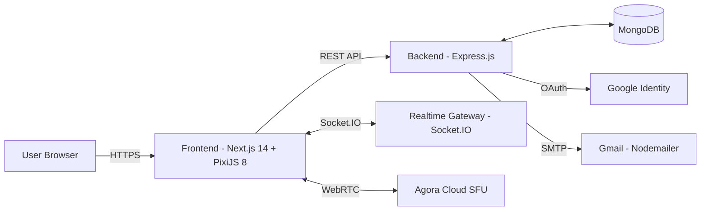
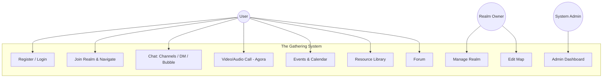
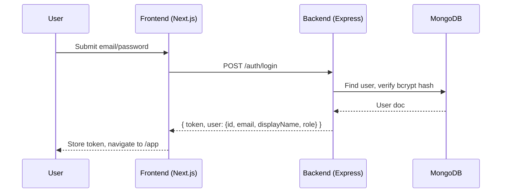
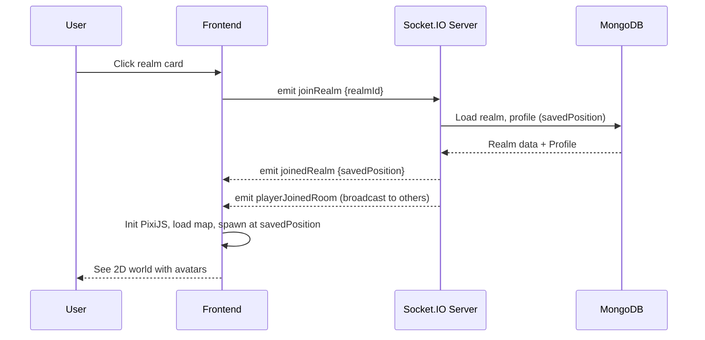
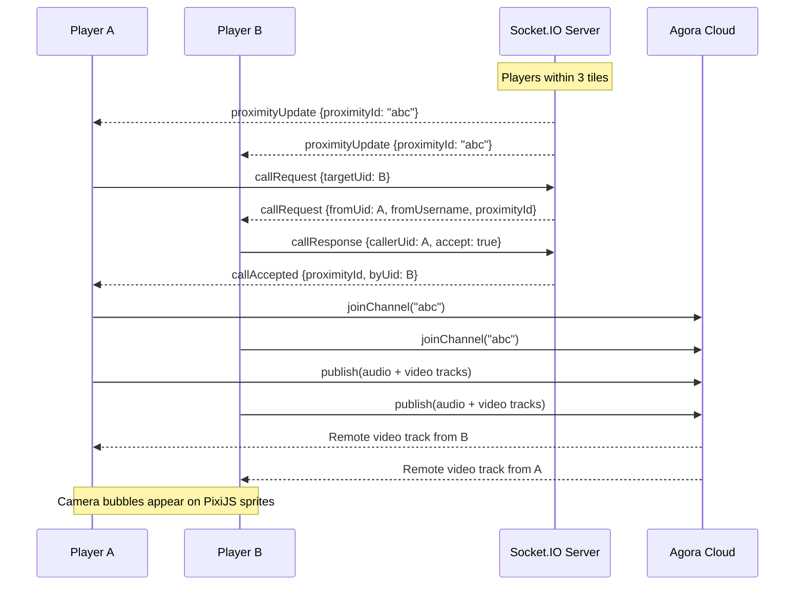
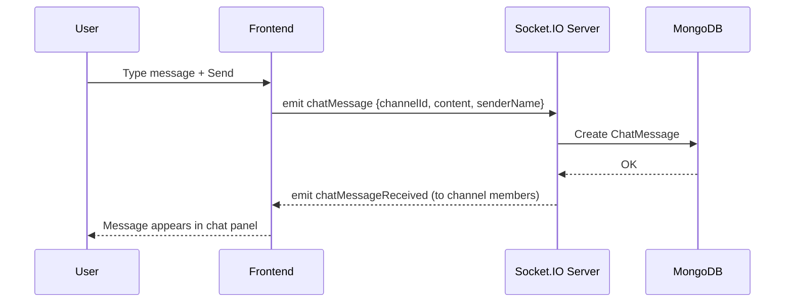
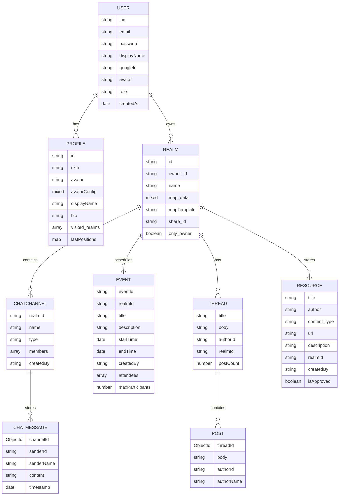

# Software Requirements Specification (SRS) – The Gathering

> Project: **The Gathering (Virtual Co-Working Space)**  
> Last updated: **2026-03-08**  
> Scope: Frontend (Next.js + PixiJS) + Backend (Express + MongoDB) + Realtime (Socket.IO + Agora RTC)

## Revision history

| Version | Date       | Description                                                                                 |
| ------: | ---------- | ------------------------------------------------------------------------------------------- |
|     0.1 | 2026-02-06 | Initial SRS draft based on project requirements.                                            |
|     0.2 | 2026-02-08 | Add assumptions/dependencies, out-of-scope, validation rules, error strategy.               |
|     1.0 | 2026-03-08 | Rewrite to match actual codebase: PixiJS, Agora RTC, Next.js. Update models, routes, APIs. |

---

## 1. Purpose

Tài liệu này mô tả yêu cầu phần mềm (functional + non-functional) cho dự án **The Gathering** – một không gian làm việc ảo 2D kiểu Gather Town. Mục tiêu là thống nhất phạm vi, hành vi hệ thống, tiêu chí nghiệm thu và ràng buộc triển khai.

---

## 2. Scope

### 2.1 In scope

The Gathering cung cấp:

- Không gian 2D (PixiJS v8) với người dùng di chuyển avatar, hiện diện theo phòng.
- Chat theo kênh / DM, in-game bubble messages.
- Audio/video call proximity-based qua Agora RTC SDK (cloud SFU).
- Quản lý spaces (realms), mời tham gia, phân quyền cơ bản.
- Event/Calendar, thư viện tài nguyên (Resource Library), cộng đồng (Forum).
- Map Editor cho chủ space tùy chỉnh bản đồ.
- Trang Admin dashboard cho quản trị hệ thống.

### 2.2 Out of scope (version hiện tại)

- Thanh toán/subscription, multi-tenant enterprise billing.
- Ghi hình/recording cuộc gọi.
- Mobile native app (iOS/Android).
- End-to-end encryption (E2EE) cho media.
- High-availability multi-region deployment / auto-scaling.
- Screen sharing.
- Service Directory (pending client approval).

### 2.3 Assumptions & dependencies

**Assumptions:**

- Số người tối đa trong 1 space: 30 (cấu hình trong backend).
- Người dùng chủ yếu truy cập qua desktop browser; mobile chỉ yêu cầu responsive cơ bản.
- Audio/video chỉ bật khi user chủ động (permission browser + toggle).
- Agora free tier (10,000 phút/tháng) đủ cho demo và beta testing.

**Dependencies:**

- **Agora RTC**: Yêu cầu `NEXT_PUBLIC_AGORA_APP_ID` hợp lệ. Có thể hoạt động ở Testing Mode (không cần `APP_CERTIFICATE`).
- **Google OAuth** (optional): Cần `GOOGLE_CLIENT_ID` / `GOOGLE_CLIENT_SECRET`.
- **Email/OTP**: Cần Gmail SMTP credentials (`EMAIL_USER`, `EMAIL_PASS`) cho Nodemailer.
- Trình duyệt hỗ trợ WebRTC (Chrome/Edge/Firefox hiện đại).

### 2.4 Future enhancements (roadmap)

- Mobile responsive optimization.
- Recording/meeting recap.
- Permission chi tiết hơn (role theo zone, moderator tools).
- Spatial audio nâng cao.
- Analytics nâng cao (funnel, retention).
- Service Directory.

---

## 3. Definitions

| Thuật ngữ | Định nghĩa |
|---|---|
| **Realm / Space** | Một không gian ảo có bản đồ, người dùng, kênh chat, events. Mỗi realm có `id` duy nhất. |
| **Room** | Một phòng trong realm (1 realm có nhiều rooms qua teleporters). |
| **User** | Người dùng đã đăng nhập (có JWT token). |
| **Profile** | Hồ sơ game của user (skin, avatar, bio, lastPositions). |
| **Presence** | Trạng thái hiện diện (online/offline, vị trí, hướng di chuyển). |
| **Channel** | Kênh chat text trong realm (channel hoặc DM). |
| **Proximity** | Khoảng cách giữa 2 player (3 tiles). Khi trong proximity, có thể gọi video. |
| **ProximityId** | ID nhóm proximity, dùng để join cùng Agora channel. |
| **SFU** | Selective Forwarding Unit — Agora Cloud xử lý việc route media streams. |
| **OTP** | One-time password dùng xác thực email. |

---

## 4. Overview

### 4.1 System Boundary

Hệ thống bao gồm:

- **Frontend Web**: Next.js 14 App Router, PixiJS game scene, React UI components.
- **Backend API**: Express.js REST API cho auth/realms/chat/events/resources/forum/admin.
- **Realtime Gateway**: Socket.IO cho presence, movement, chat, media state.
- **Media Plane**: Agora RTC SDK (cloud SFU) cho audio/video streaming.
- **Database**: MongoDB (Mongoose ODM) cho dữ liệu bền vững.

### 4.2 External Entities

- **Google Identity**: Đăng nhập OAuth.
- **Agora Cloud**: Audio/video streaming infrastructure (SFU, TURN/STUN built-in).
- **Gmail SMTP**: Gửi OTP verification emails qua Nodemailer.

### 4.3 Interactions (Context)

### 4.4 Admin separation (architecture)

| Route | Mục đích | Bảo vệ |
| ----- | -------- | ------ |
| `/app`, `/play` | User interface | JWT Auth |
| `/admin` | Admin dashboard | JWT Auth + role=admin |

- Admin truy cập qua route `/admin` riêng, không nhúng vào user UI.
- Thể hiện RBAC rõ ràng và route protection.

---

## 5. Business Goals / Constraints / Criteria

### 5.1 Business goals

- Tạo trải nghiệm "virtual office" trực quan, real-time, dễ tham gia.
- Giao tiếp đa kênh: text + audio/video, hỗ trợ teamwork.
- Dễ vận hành: có admin dashboard, rate limiting, bảo mật cơ bản.

### 5.2 Business constraints

- Chạy được trên hạ tầng phổ thông (Node.js 20+ + MongoDB).
- Agora free tier giới hạn 10,000 phút/tháng.
- Ưu tiên an toàn: validation (Zod), sanitize, rate limit.

### 5.3 Success criteria (Definition of Done)

- Người dùng đăng ký/đăng nhập thành công, JWT hoạt động.
- Người dùng vào space, thấy presence real-time, di chuyển avatar.
- Chat hoạt động real-time, persistent.
- Audio/video call hoạt động qua proximity.
- Admin xem thống kê và quản lý hệ thống.

---

## 6. Functional Requirements List

Quy ước:
- **Priority**: P0 (must), P1 (should), P2 (nice).
- **Complexity**: S (small), M (medium), L (large).

| ID    | Requirement                                                    | Priority | Complexity |
| ----- | -------------------------------------------------------------- | -------: | ---------: |
| FR-01 | Đăng ký tài khoản bằng email/password                         |       P0 |          M |
| FR-02 | Đăng nhập email/password, nhận JWT token                       |       P0 |          M |
| FR-03 | Đăng nhập bằng Google OAuth                                    |       P1 |          M |
| FR-04 | OTP verification qua email (Nodemailer)                        |       P1 |          M |
| FR-05 | User cập nhật profile (displayName, avatar, skin, bio)         |       P1 |          S |
| FR-06 | Xem danh sách spaces/realms của user                           |       P0 |          M |
| FR-07 | Tạo realm (name, mapTemplate)                                  |       P0 |          M |
| FR-08 | Xoá realm (owner) + cascade delete dữ liệu liên quan          |       P1 |          M |
| FR-09 | Tạo invite link (share_id) để mời vào realm                    |       P0 |          S |
| FR-10 | Vào realm: load map PixiJS, spawn avatar tại saved position    |       P0 |          L |
| FR-11 | Di chuyển avatar real-time + đồng bộ vị trí qua Socket.IO     |       P0 |          L |
| FR-12 | Hiển thị players online/offline + member list                  |       P0 |          M |
| FR-13 | In-game bubble messages (sendMessage/receiveMessage)           |       P0 |          M |
| FR-14 | Chat channels per realm (auto-create general, social)          |       P0 |          L |
| FR-15 | DM (Direct Message) 1-1 trong realm                            |       P1 |          M |
| FR-16 | Chat message history với pagination                            |       P0 |          M |
| FR-17 | Typing indicators real-time                                    |       P2 |          S |
| FR-18 | Proximity detection (3-tile range) + proximityId assignment    |       P0 |          L |
| FR-19 | Call request/accept/reject workflow khi trong proximity         |       P0 |          L |
| FR-20 | Audio/video streaming qua Agora RTC SDK                        |       P0 |          L |
| FR-21 | Camera bubble hiển thị trên đầu avatar (PixiJS + MediaStream)  |       P0 |          L |
| FR-22 | Remote video: thấy camera người khác trên sprite               |       P0 |          L |
| FR-23 | Video call panel: draggable, resizable, minimize không ngắt    |       P1 |          M |
| FR-24 | Events: tạo/sửa/xoá event trong realm, RSVP                   |       P1 |          M |
| FR-25 | Resource Library: CRUD resources, search, filter by type        |       P1 |          M |
| FR-26 | Forum: threads + replies per realm                              |       P1 |          M |
| FR-27 | Admin dashboard: thống kê, charts, quản lý users/realms/events |       P1 |          L |
| FR-28 | Map Editor: paint tiles, special tiles, room management         |       P1 |          L |
| FR-29 | Minimap + Overview map + Zoom controls                          |       P2 |          M |
| FR-30 | Zone system: named zones, zone popup on enter                   |       P2 |          M |
| FR-31 | Focus Room: Lofi music streaming                                |       P2 |          S |
| FR-32 | Position memory: lưu/khôi phục vị trí khi re-enter realm       |       P1 |          M |
| FR-33 | Sidebar collapse/expand (Gather.town style)                     |       P1 |          S |
| FR-34 | View Selector: Simplified / Immersive / Auto modes              |       P2 |          S |

---

## 7. Use Cases

### 7.1 Actors

- **User**: Sử dụng đầy đủ tính năng trong realm.
- **Realm Owner**: Quản trị realm (edit map, delete realm).
- **System Admin**: Quản trị hệ thống (admin dashboard).

### 7.2 Use Case Diagram (high-level)

### 7.3 Use Case Descriptions

#### UC-01 Register account

- **Primary actor**: User
- **Preconditions**: Email chưa tồn tại trong hệ thống.
- **Main flow**:
  1. User chọn phương thức: Email/Password hoặc Google OAuth.
  2. (Email) User nhập email, password. Hệ thống gửi OTP qua Nodemailer.
  3. User nhập OTP để verify.
  4. Hệ thống tạo User + Profile, trả JWT token.
- **Postconditions**: User có thể truy cập `/app` dashboard.
- **Acceptance criteria**:
  - Password hash bằng bcrypt (10 rounds).
  - OTP hết hạn sau 10 phút.

#### UC-02 Join a realm

- **Primary actor**: User
- **Preconditions**: User đã đăng nhập, có realmId hợp lệ hoặc invite link.
- **Main flow**:
  1. User chọn realm từ dashboard hoặc dùng invite link.
  2. Frontend kết nối Socket.IO với `joinRealm {realmId}`.
  3. Server trả `joinedRealm` với savedPosition (nếu có).
  4. Frontend khởi tạo PixiJS, load map, spawn avatar.
- **Postconditions**: User xuất hiện trên bản đồ, thấy players khác.
- **Acceptance criteria**:
  - Nếu có savedPosition, spawn tại vị trí cũ.
  - Nếu không, spawn tại default spawnpoint.

#### UC-03 Proximity video call

- **Primary actor**: 2 Users gần nhau (≤3 tiles)
- **Preconditions**: Cả 2 đã join cùng realm.
- **Main flow**:
  1. Server detect proximity (3 tiles), gửi `proximityUpdate` với `proximityId`.
  2. User A gửi `callRequest {targetUid}`.
  3. User B nhận `callRequest` popup, chọn Accept.
  4. User B gửi `callResponse {callerUid, accept: true}`.
  5. Cả 2 join Agora channel với `proximityId`.
  6. Camera bubbles hiển thị trên sprites.
- **Postconditions**: Audio/video call hoạt động.
- **Acceptance criteria**:
  - Call tự ngắt khi rời proximity.
  - Camera bubble hiển thị trên đầu avatar trong PixiJS.

#### UC-04 Send persistent chat message

- **Primary actor**: User
- **Preconditions**: User đã join realm.
- **Main flow**:
  1. User chọn channel hoặc DM.
  2. User gõ tin nhắn, nhấn Send.
  3. Frontend emit `chatMessage {channelId, content, senderName}`.
  4. Backend lưu ChatMessage vào MongoDB.
  5. Server broadcast `chatMessageReceived` tới channel members.
- **Postconditions**: Tin nhắn hiển thị cho tất cả members.

---

## 8. Key Flows (Mermaid)

### 8.1 Auth (Login)

### 8.2 Join Realm & Presence

### 8.3 Proximity Video Call (Agora)

### 8.4 Realtime Chat

---

## 9. Non-Functional Requirements

### 9.1 Security

- **NFR-S1**: Input phải được validate bằng Zod schemas (body/query/socket payloads).
- **NFR-S2**: Rate limiting cho auth endpoints (5 requests/15 phút).
- **NFR-S3**: Password hash bằng bcrypt (10 rounds).
- **NFR-S4**: RBAC: user vs admin roles cho admin endpoints.
- **NFR-S5**: JWT token cho authentication, 7-day expiry.
- **NFR-S6**: CORS configured theo `CLIENT_URL`.

### 9.2 Performance

- **NFR-P1**: Chat message pagination, limit tối đa per request.
- **NFR-P2**: Movement/presence throttling qua Socket.IO.
- **NFR-P3**: PixiJS video bubble cập nhật 15fps (canvas-based) thay vì PIXI.VideoSource.
- **NFR-P4**: Max 30 players per space.

### 9.3 Availability & Reliability

- **NFR-A1**: Socket.IO auto-reconnect khi mất kết nối.
- **NFR-A2**: Agora RTC fallback: hoạt động ở Testing Mode nếu không có APP_CERTIFICATE.
- **NFR-A3**: Position memory: lưu vị trí khi disconnect, restore khi re-join.

### 9.4 Usability

- **NFR-U1**: Sidebar collapse/expand để tối ưu không gian.
- **NFR-U2**: View Selector cho phép chọn chế độ hiển thị.
- **NFR-U3**: Sidebar dùng flex layout (không fixed positioning) để không bị mất khi zoom.

### 9.5 Compatibility

- **NFR-C1**: Hỗ trợ Chrome, Edge, Firefox phiên bản hiện đại.
- **NFR-C2**: WebRTC qua Agora SDK xử lý NAT traversal tự động.

### 9.6 Data validation rules

- Display name: tối đa 100 ký tự.
- In-game bubble message: tối đa 300 ký tự.
- Chat message: tối đa 500 ký tự.
- Bio: tối đa 500 ký tự.
- Realm name: tối đa 200 ký tự.
- Event title: tối đa 200 ký tự.
- Thread title: tối đa 300 ký tự.
- Post/thread body: tối đa 5000 ký tự.
- Resource description: tối đa 2000 ký tự.
- IDs: UUID format cho realm, event; ObjectId cho MongoDB references.
- Pagination: enforce limit min/max theo endpoint.

### 9.7 Error handling strategy

- **REST**: HTTP status codes `4xx` (client) và `5xx` (server); payload `{ message: string }`.
- **Rate limit (HTTP)**: trả `429`.
- **Socket.IO**: lỗi gửi qua event `failedToJoinRoom` hoặc callback.
- **Agora**: nếu lỗi join channel, client log error, fallback audio-only hoặc retry.

---

## 10. System Constraints

- **SC-01**: Backend chạy Node.js 20+.
- **SC-02**: Database là MongoDB, index trên `realmId`, `channelId`, `timestamp`, `owner_id`.
- **SC-03**: CORS configured theo `CLIENT_URL` environment variable.
- **SC-04**: Agora RTC yêu cầu valid App ID; NAT traversal handled by Agora.
- **SC-05**: PixiJS không dùng `PIXI.VideoSource` cho live MediaStream (gây stack overflow). Dùng canvas-based rendering thay thế.

### 10.1 Deployment / environments

- **Development**: Next.js dev server + Express + MongoDB local, hot-reload bằng `tsx watch`.
- **Production**: HTTPS required; CORS chặt; Agora App Certificate configured.

### 10.2 Key environment variables

**Frontend (.env.local):**

| Variable | Required | Description |
|---|:---:|---|
| `NEXT_PUBLIC_BACKEND_URL` | Yes | Backend API URL (e.g., `http://localhost:5001`) |
| `NEXT_PUBLIC_AGORA_APP_ID` | Yes | Agora RTC App ID |
| `APP_CERTIFICATE` | No | Agora App Certificate (for token generation) |
| `GOOGLE_CLIENT_ID` | No | Google OAuth Client ID |

**Backend (.env):**

| Variable | Required | Description |
|---|:---:|---|
| `PORT` | Yes | Server port (default 5001) |
| `MONGODB_URI` | Yes | MongoDB connection string |
| `JWT_SECRET` | Yes | Secret for JWT signing |
| `CLIENT_URL` | Yes | Frontend URL for CORS |
| `EMAIL_USER` | No | Gmail address for OTP |
| `EMAIL_PASS` | No | Gmail App Password |
| `GOOGLE_CLIENT_ID` | No | Google OAuth Client ID |
| `GOOGLE_CLIENT_SECRET` | No | Google OAuth Client Secret |

---

## 11. Backend Requirements

- **BR-01**: REST API routes: auth, realms, profiles, chat, events, resources, forum, admin, game state.
- **BR-02**: Socket.IO events cho presence, movement, chat, media state, proximity, call signaling.
- **BR-03**: Zod validation cho tất cả input.
- **BR-04**: Express error handler + rate limiting middleware.

## 12. Frontend Requirements

- **FRN-01**: Next.js 14 App Router: landing, signin, app dashboard, play (game), editor, manage, admin, profile.
- **FRN-02**: PixiJS v8 cho 2D map rendering, avatar animation, camera bubbles.
- **FRN-03**: Agora RTC SDK cho audio/video streaming.
- **FRN-04**: Socket.IO client cho real-time presence, chat, media state.
- **FRN-05**: Tailwind CSS cho responsive UI.

## 13. Realtime / Media Requirements

- **MR-01**: Agora RTC cloud SFU cho audio/video (không cần self-host media server).
- **MR-02**: Toggle audio/video, publish/unpublish tracks.
- **MR-03**: Proximity-based channel joining: players trong 3 tiles share Agora channel.
- **MR-04**: Camera bubble rendering: canvas-based frame extraction (15fps) → PixiJS Texture.
- **MR-05**: Remote video tracks: receive qua Agora `onUserPublished`, render trên remote player sprites.

---

## 14. REST API Specification

### 14.1 Conventions

- Base URL: `http://localhost:5001` (development)
- Authentication: `Authorization: Bearer <JWT token>`
- JWT payload: `{ userId }`, TTL: 7 days
- Error response format: `{ message: string }`

### 14.2 Auth (`/auth`)

| Method | Endpoint | Auth | Description |
|---|---|:---:|---|
| POST | `/auth/send-otp` | No | Gửi OTP code qua email (rate-limited) |
| POST | `/auth/verify-otp` | No | Verify OTP, tạo user nếu mới, trả JWT |
| POST | `/auth/register` | No | Đăng ký bằng email + password |
| POST | `/auth/login` | No | Đăng nhập, trả JWT (rate-limited) |
| POST | `/auth/google` | No | Google OAuth login/registration |
| GET | `/auth/me` | Yes | Lấy thông tin user từ JWT |

### 14.3 Realms (`/realms`)

| Method | Endpoint | Auth | Description |
|---|---|:---:|---|
| GET | `/realms` | Yes | Danh sách realms của user (paginated) |
| GET | `/realms/by-share/:shareId` | No | Lấy realm theo share link |
| GET | `/realms/:id` | Yes | Lấy realm theo ID |
| GET | `/realms/:id/members` | Yes | Members: online + offline |
| POST | `/realms` | Yes | Tạo realm mới {name, mapTemplate} |
| PATCH | `/realms/:id` | Yes | Update realm (map_data, name, share_id, only_owner) |
| DELETE | `/realms/:id` | Yes | Xoá realm + cascade (channels, messages, events, resources, threads, posts) |

### 14.4 Profiles (`/profiles`)

| Method | Endpoint | Auth | Description |
|---|---|:---:|---|
| GET | `/profiles/me` | Yes | Lấy profile (auto-create nếu chưa có) |
| PATCH | `/profiles/me` | Yes | Update: displayName, bio, avatar, skin, avatarConfig |

### 14.5 Chat (`/chat`)

| Method | Endpoint | Auth | Description |
|---|---|:---:|---|
| GET | `/chat/channels/:realmId` | Yes | Danh sách channels + DMs (auto-create general, social) |
| POST | `/chat/channels` | Yes | Tạo channel hoặc DM (deduplicate DMs) |
| GET | `/chat/messages/:channelId` | Yes | Messages paginated |
| DELETE | `/chat/channels/:channelId` | Yes | Xoá channel (owner only, không xoá defaults) |

### 14.6 Events (`/events`)

| Method | Endpoint | Auth | Description |
|---|---|:---:|---|
| GET | `/events` | Yes | Events cho realm (filter month/year, paginated) |
| POST | `/events` | Yes | Tạo event |
| PATCH | `/events/:id` | Yes | Update event (creator only) |
| DELETE | `/events/:id` | Yes | Xoá event (creator only) |
| POST | `/events/:id/rsvp` | Yes | RSVP: going / maybe / not_going |

### 14.7 Resources (`/resources`)

| Method | Endpoint | Auth | Description |
|---|---|:---:|---|
| GET | `/resources` | Yes | Danh sách resources (filter type, search, paginated) |
| POST | `/resources` | Yes | Tạo resource |
| DELETE | `/resources/:id` | Yes | Xoá resource (creator only) |

### 14.8 Forum (`/forum`)

| Method | Endpoint | Auth | Description |
|---|---|:---:|---|
| GET | `/forum/threads` | Yes | Threads cho realm (paginated) |
| GET | `/forum/threads/:id` | Yes | Thread + posts (paginated) |
| POST | `/forum/threads` | Yes | Tạo thread |
| POST | `/forum/threads/:id/posts` | Yes | Reply to thread |
| DELETE | `/forum/threads/:id` | Yes | Xoá thread + posts (author only) |
| DELETE | `/forum/posts/:id` | Yes | Xoá post (author only) |

### 14.9 Game State (`/`)

| Method | Endpoint | Auth | Description |
|---|---|:---:|---|
| GET | `/getPlayersInRoom` | No | Players trong 1 room |
| GET | `/getPlayerCounts` | No | Player counts cho nhiều realms |

### 14.10 Admin (`/admin`) — Yêu cầu role=admin

| Method | Endpoint | Description |
|---|---|---|
| GET | `/admin/stats` | Overview stats (users, realms, events, resources, threads, posts, messages) |
| GET | `/admin/stats/users-trend` | User registration trend (12 tháng) |
| GET | `/admin/stats/resources-by-type` | Phân bố resources theo type |
| GET | `/admin/stats/realms-per-owner` | Top 10 realm owners |
| GET | `/admin/stats/forum-activity` | Forum activity (30 ngày) |
| GET | `/admin/users` | List users (searchable, paginated) |
| PATCH | `/admin/users/:id/role` | Đổi role user |
| DELETE | `/admin/users/:id` | Xoá user + all data |
| GET | `/admin/realms` | List tất cả realms |
| DELETE | `/admin/realms/:id` | Xoá realm + cascade |
| GET | `/admin/events` | List tất cả events |
| DELETE | `/admin/events/:id` | Xoá event |
| GET | `/admin/resources` | List tất cả resources |
| DELETE | `/admin/resources/:id` | Xoá resource |
| GET | `/admin/threads` | List tất cả threads |
| DELETE | `/admin/threads/:id` | Xoá thread + posts |

---

## 15. Socket.IO Realtime Contract

### 15.1 Client → Server Events

| Event | Payload | Description |
|---|---|---|
| `joinRealm` | `{realmId, shareId?}` | Join realm/space |
| `disconnect` | — | Player disconnects (server saves position) |
| `movePlayer` | `{x, y}` | Move player trên tile grid |
| `teleport` | `{x, y, roomIndex}` | Teleport tới room/tile |
| `changedSkin` | `string` | Đổi character skin |
| `sendMessage` | `string` | Gửi in-game bubble message (max 300 chars) |
| `mediaState` | `{micOn, camOn}` | Update mic/cam state |
| `callRequest` | `{targetUid}` | Request call với nearby player |
| `callResponse` | `{callerUid, accept}` | Accept/reject call |
| `joinChatChannel` | `channelId` | Join chat channel room |
| `leaveChatChannel` | `channelId` | Leave chat channel room |
| `chatMessage` | `{channelId, content, senderName}` | Gửi persistent chat message |
| `chatTyping` | `{channelId, username}` | Typing indicator |
| `joinLobby` | `{displayName?}` | Join lobby chat (pre-game) |
| `sendLobbyMessage` | `{message}` | Gửi lobby message |

### 15.2 Server → Client Events

| Event | Payload | Description |
|---|---|---|
| `joinedRealm` | `{savedPosition?}` | Confirm join, trả saved position |
| `failedToJoinRoom` | `{reason}` | Join thất bại |
| `playerJoinedRoom` | `{uid, ...playerData}` | Player khác vào room |
| `playerLeftRoom` | `{uid}` | Player rời room |
| `playerMoved` | `{uid, x, y}` | Player di chuyển |
| `playerTeleported` | `{uid, x, y}` | Player teleport |
| `playerChangedSkin` | `{uid, skin}` | Player đổi skin |
| `receiveMessage` | `{uid, message}` | Bubble message |
| `proximityUpdate` | `{proximityId}` | Proximity group thay đổi |
| `remoteMediaState` | `{uid, micOn, camOn}` | Media state player khác |
| `callRequest` | `{fromUid, fromUsername, proximityId}` | Incoming call |
| `callAccepted` | `{proximityId, byUid, byUsername}` | Call accepted |
| `callRejected` | `{byUid, byUsername}` | Call rejected |
| `chatMessageReceived` | `{channelId, message}` | New chat message |
| `chatUserTyping` | `{channelId, username}` | User typing |
| `lobbyHistory` | `messages[]` | Lobby history on join |
| `lobbyMessage` | `{message}` | New lobby message |

### 15.3 Agora RTC Signals (Frontend internal)

Các signals nội bộ frontend (không qua Socket.IO, dùng cho PixiJS integration):

| Signal | Payload | Description |
|---|---|---|
| `remoteVideoPublished` | `{agoraUid, track}` | Remote user published video track |
| `remoteVideoUnpublished` | `{agoraUid}` | Remote user unpublished video |
| `leaveGroupCall` | — | Trigger khi rời proximity |

---

## 16. Data Model (MongoDB / Mongoose)

### 16.1 ER Diagram

### 16.2 Data Dictionary

#### User

| Field | Type | Constraints |
|---|---|---|
| email | String | Required, unique, lowercase, trimmed |
| password | String | Optional, hashed bcrypt, min 6 chars |
| displayName | String | Max 100 |
| googleId | String | Unique, sparse |
| avatar | String | URL or avatar ID |
| role | Enum | `'user'` (default) \| `'admin'` |
| createdAt | Date | Auto (timestamps) |

#### Profile

| Field | Type | Constraints |
|---|---|---|
| id | String | Required, unique (maps to User._id) |
| skin | String | Character skin ID |
| avatar | String | |
| avatarConfig | Mixed | Record<string, string> |
| displayName | String | Max 100 |
| bio | String | Max 500, default `''` |
| visited_realms | String[] | Max 500 entries |
| lastPositions | Map | `{[realmId]: {x, y, room}}` |

#### Realm

| Field | Type | Constraints |
|---|---|---|
| id | String | UUID, unique |
| owner_id | String | Required, indexed |
| name | String | Required, max 200 |
| map_data | Mixed | Tilemap (rooms, spawnpoint, tiles) |
| mapTemplate | String | Default: `'office'` |
| share_id | String | Sparse, indexed |
| only_owner | Boolean | Default: false |

#### ChatChannel

| Field | Type | Constraints |
|---|---|---|
| realmId | String | Required, indexed |
| name | String | Required, max 50 |
| type | Enum | `'channel'` \| `'dm'` |
| members | String[] | User IDs (for DMs) |
| createdBy | String | Required |

#### ChatMessage

| Field | Type | Constraints |
|---|---|---|
| channelId | ObjectId | Ref: ChatChannel, indexed |
| senderId | String | Required |
| senderName | String | Required |
| content | String | Required, max 500 |
| timestamp | Date | Default: now, indexed |

#### Event

| Field | Type | Constraints |
|---|---|---|
| eventId | String | UUID, unique |
| realmId | String | Required |
| title | String | Required, max 200 |
| description | String | Max 2000 |
| startTime | Date | Required |
| endTime | Date | Required, after startTime |
| createdBy | String | Required |
| createdByName | String | Max 100 |
| attendees | Array | `{userId, username, status}`, max 200 |
| location | String | Max 300 |
| maxParticipants | Number | Optional, min 1 |

#### Thread

| Field | Type | Constraints |
|---|---|---|
| title | String | Required, max 300 |
| body | String | Max 5000 |
| authorId | String | Required |
| authorName | String | Required, max 100 |
| realmId | String | Required |
| postCount | Number | Default: 0 |
| lastPostAt | Date | |

#### Post

| Field | Type | Constraints |
|---|---|---|
| threadId | ObjectId | Ref: Thread, indexed |
| body | String | Required, max 5000 |
| authorId | String | Required |
| authorName | String | Required, max 100 |

#### Resource

| Field | Type | Constraints |
|---|---|---|
| title | String | Required, max 300 |
| author | String | Max 200 |
| content_type | Enum | `guide` \| `ebook` \| `course` \| `video` \| `audio` \| `other` |
| url | String | |
| thumbnail_url | String | |
| description | String | Max 2000, text search |
| realmId | String | Nullable |
| createdBy | String | Nullable, indexed |
| createdByName | String | |
| isApproved | Boolean | Default: true |

---

## 17. Detailed Use Cases (Testable)

### UC-Auth-01 Login + token creation

- **Preconditions**: User exists, valid credentials.
- **Main flow**:
  1. Client calls `POST /auth/login {email, password}`.
  2. Server verifies bcrypt hash.
  3. Server trả `{ token, user: {id, email, displayName, role} }`.
- **Alternate flows**:
  - A1: Wrong password → `401`.
  - A2: Rate limit exceeded → `429`.

### UC-Realm-01 Join realm (Socket)

- **Preconditions**: Realm exists, user authenticated.
- **Main flow**:
  1. Client connects Socket.IO with `uid` query param.
  2. Client emits `joinRealm {realmId}`.
  3. Server loads realm + profile (lastPositions).
  4. Server emits `joinedRealm {savedPosition}`.
  5. Server broadcasts `playerJoinedRoom` to room.
- **Errors**:
  - E1: Realm not found → `failedToJoinRoom`.
  - E2: Private realm, not owner → `failedToJoinRoom`.

### UC-Chat-01 Send message (persisted)

- **Preconditions**: User joined realm, channel exists.
- **Main flow**:
  1. Client emits `chatMessage {channelId, content, senderName}`.
  2. Server validates content (Zod, max 500 chars).
  3. Server creates ChatMessage in MongoDB.
  4. Server emits `chatMessageReceived` to channel socket room.

### UC-Proximity-01 Proximity-based video call

- **Preconditions**: 2 users in same realm, within 3 tiles.
- **Main flow**:
  1. Server detects proximity, assigns `proximityId`.
  2. Server emits `proximityUpdate` to both players.
  3. Player A emits `callRequest {targetUid: B}`.
  4. Server forwards `callRequest` to Player B.
  5. Player B emits `callResponse {callerUid: A, accept: true}`.
  6. Server emits `callAccepted` to Player A.
  7. Both players join Agora channel with `proximityId`.
  8. Agora handles media routing.
- **Alternate flows**:
  - A1: Player B rejects → `callRejected`.
  - A2: Players move apart → server emits new `proximityUpdate`, call auto-ends.

---

## 18. Traceability Matrix (FR → Implementation)

| Requirement | Backend (REST) | Backend (Socket) | Models | Frontend |
|---|---|---|---|---|
| FR-01..04 | `/auth/*` | — | User | signin/page.tsx |
| FR-05 | `/profiles/me` | — | Profile | PlayNavbar.tsx, profile/ |
| FR-06..09 | `/realms/*` | `joinRealm` | Realm, Profile | app/page.tsx, RealmsMenu |
| FR-10..12 | — | `joinRealm`, `playerJoinedRoom`, `playerMoved` | — | PlayApp.ts, Player.ts |
| FR-13 | — | `sendMessage`, `receiveMessage` | — | Player.ts (bubble) |
| FR-14..17 | `/chat/*` | `chatMessage`, `chatTyping` | ChatChannel, ChatMessage | ChatPanel.tsx |
| FR-18..22 | — | `proximityUpdate`, `callRequest/Response`, `mediaState` | — | ProximityCallPrompt, video-chat.ts, Player.ts |
| FR-23 | — | — | — | GroupCallPanel.tsx (Agora-based) |
| FR-24 | `/events/*` | — | Event | CalendarPanel.tsx |
| FR-25 | `/resources/*` | — | Resource | LibraryPanel.tsx |
| FR-26 | `/forum/*` | — | Thread, Post | ForumPanel.tsx |
| FR-27 | `/admin/*` | — | All | admin/page.tsx |
| FR-28 | — | — | Realm (map_data) | editor/ |
| FR-29..30 | — | — | — | MiniMap, OverviewMap, ZonePopup |
| FR-31 | — | — | — | FocusRoomPanel.tsx |
| FR-32 | `/profiles/me` | `joinRealm` (savedPosition) | Profile (lastPositions) | PlayApp.ts |
| FR-33..34 | — | — | — | PlaySidebar, ViewSelector |

---

## 19. Known Gaps / Implementation Notes

1. **Agora Testing Mode**: Khi không có `APP_CERTIFICATE`, `generateToken` trả `null`. `videoChat.joinChannel()` vẫn hoạt động với Agora Testing Mode (join với token `null`). Production cần configure certificate.

2. **PixiJS Video Rendering**: `PIXI.VideoSource` gây `Maximum call stack size exceeded` với live MediaStream. Workaround: dùng off-screen `HTMLCanvasElement` + `setInterval` 15fps để draw video frames → update `PIXI.Texture`.

3. **Sidebar Layout**: Dùng flex layout thay vì fixed positioning để tránh sidebar biến mất khi browser zoom.

4. **File Naming**: `GroupCallPanel.tsx` là Agora-based video call panel (đã đổi tên từ `JitsiCallPanel.tsx` sau migration Jitsi → Agora).

5. **Offline Member Names**: Name resolution fallback: `Profile.displayName` → `User.displayName` → `formatEmailToName(User.email)` → `id.slice(0,8)`.

6. **Max Players**: Hiện limit 30 players/space. Tăng thêm cần optimize Socket.IO broadcasting và PixiJS rendering.
