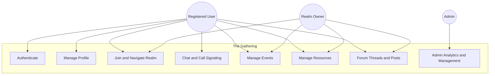
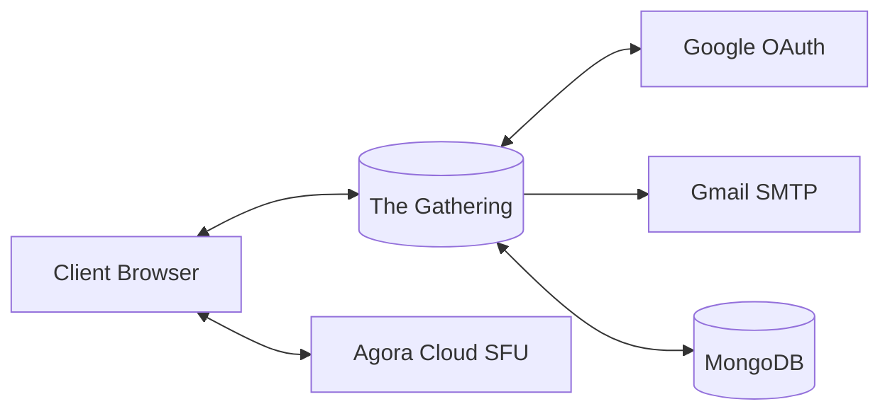
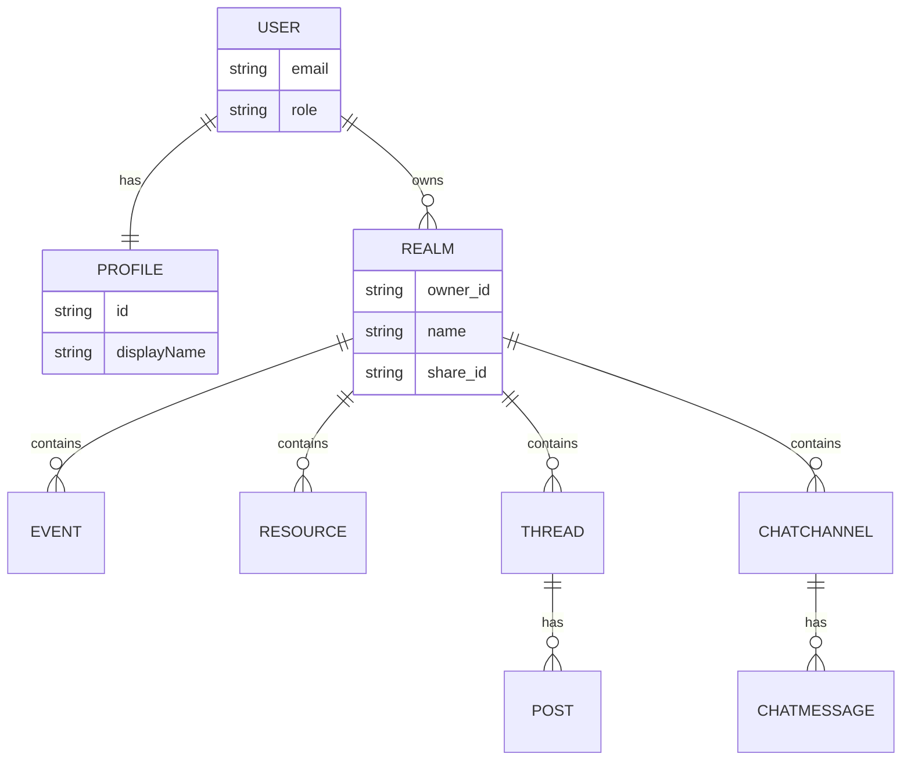

# Software Requirements Specification (SRS)

## 1. Introduction

### 1.1 Purpose of the System

The Gathering is a web-based virtual co-working platform designed to support remote collaboration through a shared 2D spatial environment. Users are represented by avatars, communicate through real-time text and signaling-based call workflows, and use integrated community features such as events, resource sharing, and forum discussions. This SRS defines the requirements for the current implemented system and serves as a baseline for development, testing, and capstone reporting.

### 1.2 Scope of the System

The implemented scope includes:

- Account onboarding and authentication (email/password, OTP verification, Google OAuth, JWT session handling).
- User profile management (display name, bio, skin, avatar configuration).
- Realm (space) lifecycle (create, read, update, delete, sharing, access control).
- Real-time spatial interaction (join realm, movement, teleport, proximity updates).
- Communication (in-world bubble chat, lobby chat, persistent channels/DMs, call request/accept/reject signaling, media state sync).
- Collaboration features (events with RSVP, resource library, forum threads/posts).
- Administration (admin-only analytics and management endpoints).

Out of scope for the current implemented iteration:

- Service Directory feature (identified in brief as pending approval).
- Native mobile applications.
- 3D/VR implementation.

### 1.3 Definitions and Abbreviations

- API: Application Programming Interface.
- JWT: JSON Web Token used for stateless authentication.
- OTP: One-Time Password for email verification flow.
- RBAC: Role-Based Access Control.
- SFU: Selective Forwarding Unit (Agora cloud media architecture).
- DM: Direct Message channel between two users.
- Realm: A virtual 2D collaboration space.
- RTM: Requirement Traceability Matrix.
- SRS: Software Requirements Specification.
- NFR: Non-Functional Requirement.

### 1.4 References

- `doc/techbrief.md`
- `doc/charter.md`
- `doc/User_Story.md`
- `doc/Functional_Requirements.md`
- `doc/Non_Functional_Requirements.md`
- `doc/RTM.md`
- `doc/Use_Case_Modeling.md`
- `doc/UseCase_Description.md`
- `doc/Context_Diagram.md`
- `doc/ALL_SC.md`
- `backend/src/index.ts`
- `backend/src/routes/*.ts`
- `backend/src/sockets/sockets.ts`
- `backend/src/models/*.ts`
- `frontend/app/*`

## 2. Overall Description

### 2.1 System Perspective

The Gathering is a monorepo full-stack web system with:

- Frontend: Next.js (React, Tailwind CSS, PixiJS).
- Backend: Express.js + Socket.IO + TypeScript.
- Data layer: MongoDB via Mongoose.
- External service dependencies: Google OAuth, Gmail/Nodemailer SMTP, Agora RTC.

The system combines REST APIs for transactional/domain operations and WebSocket events for low-latency real-time interactions.

### 2.2 System Context

Primary context interactions include:

- Client browser <-> backend over HTTPS (authentication, profile, CRUD features).
- Client browser <-> backend over Socket.IO (realm join, movement, messaging, call signaling).
- Backend <-> MongoDB (persistent data storage).
- Backend <-> Google OAuth (social login credential flow).
- Backend <-> SMTP (OTP email delivery).
- Client browser <-> Agora cloud (audio/video transport).

### 2.3 User Classes and Characteristics

- Guest: unauthenticated visitor who can access public pages and begin registration/login.
- Registered User: authenticated user who can join realms, communicate, and use collaboration features.
- Realm Owner: registered user with ownership rights over a realm (settings, updates, deletion).
- Admin: user with `role=admin`, authorized for platform-level management and analytics.
- System Maintainer (indirect stakeholder): development/operations role managing deployment, environment configuration, and quality control.

### 2.4 Operating Environment

- Client runtime: modern browsers (Chrome, Edge, Firefox).
- Frontend runtime: Node.js environment for Next.js build and server rendering.
- Backend runtime: Node.js, TypeScript compilation target, Express server.
- Database runtime: MongoDB.
- Network requirements: internet connectivity for OAuth/SMTP/Agora integrations and real-time Socket.IO communication.

### 2.5 Design Constraints

- Authentication is JWT-based with server-side secret requirement (`JWT_SECRET`).
- OTP email flow depends on SMTP credentials (`EMAIL_USER`, `EMAIL_PASS`).
- CORS origin is constrained by configured client URL (`FRONTEND_URL`/`CLIENT_URL`).
- Admin features are constrained by RBAC (`role` must be `admin`).
- Realm concurrency is constrained by server logic (maximum 30 players per space).
- Backend uses schema/model constraints (field lengths, enum values, validation hooks).

### 2.6 Assumptions and Dependencies

- Users have stable internet for real-time collaboration.
- Browser grants microphone/camera permissions for media-related features.
- MongoDB is available and reachable at runtime.
- External providers (Google OAuth, SMTP service, Agora cloud) are operational.
- Environment variables are configured before deployment.

## 3. System Features (Functional Requirements)

FR1: The system shall allow users to request OTP codes via email for account verification and passwordless sign-in flow.

FR2: The system shall verify submitted OTP codes with expiration and rate-limit control before issuing authenticated JWT sessions.

FR3: The system shall support account registration with email and password, including validation and password hashing.

FR4: The system shall support login with email and password and return JWT credentials for authenticated use.

FR5: The system shall support login using Google credential payloads and map/link users to local accounts.

FR6: The system shall expose authenticated identity retrieval (`/auth/me`) for session continuity.

FR7: The system shall provide protected route behavior in frontend middleware and backend authorization checks.

FR8: The system shall provide profile retrieval and update operations for authenticated users.

FR9: The system shall allow profile customization fields including display name, bio, skin, avatar, and avatar configuration.

FR10: The system shall persist and restore per-user, per-realm last positions across disconnect/rejoin events.

FR11: The system shall allow authenticated users to create realms with template metadata and share identifiers.

FR12: The system shall allow realm owners to update realm metadata (name, map data, privacy, sharing controls).

FR13: The system shall allow realm owners to delete realms and cascade deletion of dependent domain data.

FR14: The system shall allow users to retrieve realms by owner and by share link.

FR15: The system shall validate realm join requests and enforce access rules (owner access, privacy mode, share link validity, capacity limit).

FR16: The system shall establish authenticated Socket.IO sessions for real-time interactions.

FR17: The system shall synchronize avatar movement events in real time for users in the same room context.

FR18: The system shall support teleport events and room transitions with proper join/leave broadcasts.

FR19: The system shall compute and emit proximity updates for affected users during movement/teleport changes.

FR20: The system shall support in-world bubble chat with message normalization and length constraints.

FR21: The system shall support lobby chat with bounded in-memory history and live broadcast.

FR22: The system shall support persistent chat channels and DM channels with membership checks.

FR23: The system shall persist channel messages and provide paginated retrieval.

FR24: The system shall support call signaling workflows (`callRequest`, `callResponse`, `callAccepted`, `callRejected`) for eligible users.

FR25: The system shall synchronize media state indicators (microphone/camera on-off) across participants.

FR26: The system shall provide event management (create/list/update/delete) scoped to realms.

FR27: The system shall support event RSVP status management (`going`, `maybe`, `not_going`) with participant constraints.

FR28: The system shall provide resource library management (create/list/delete) with search, type filters, and realm scoping.

FR29: The system shall provide forum thread management and post/reply operations with pagination.

FR30: The system shall enforce ownership authorization for deleting or modifying protected forum/resource/realm content.

FR31: The system shall provide admin-only analytics endpoints for platform metrics and trends.

FR32: The system shall provide admin CRUD operations over users, realms, events, resources, and forum threads.

FR33: The system shall provide standardized error responses for unauthorized, forbidden, not found, validation, and server error conditions.

FR34: The system shall enforce payload validation for REST and socket workflows before mutating state.

## 4. Non-Functional Requirements

NFR1 (Performance): The system shall support paginated retrieval for chat messages, events, resources, forum threads, and admin tables to limit per-request load.

NFR2 (Performance): The real-time engine shall keep movement and teleport synchronization responsive through Socket.IO event handling and room-scoped emission.

NFR3 (Performance): The system shall enforce a maximum of 30 concurrent players per space for runtime stability.

NFR4 (Security): The system shall require JWT validation for protected HTTP and socket workflows.

NFR5 (Security): The system shall hash stored passwords with bcrypt (10 rounds).

NFR6 (Security): The system shall apply rate limiting on authentication and OTP endpoints.

NFR7 (Security): The system shall enforce RBAC for admin endpoints and return `403` for non-admin users.

NFR8 (Security): The system shall apply CORS restrictions based on configured client origins.

NFR9 (Availability): The realtime client-server design shall support reconnect behavior after temporary network loss.

NFR10 (Reliability): The system shall preserve last player position and restore it when users rejoin a realm.

NFR11 (Scalability): Media transport shall be delegated to Agora cloud SFU architecture instead of peer-to-peer mesh for multi-user calls.

NFR12 (Usability): The UI shall provide authenticated navigation and feature panels for chat, events, resources, forum, and admin by user role.

NFR13 (Usability): Profile, messaging, and content forms shall enforce input constraints with clear validation responses.

NFR14 (Reliability): The backend shall use centralized global error handling to prevent unhandled server crashes.

NFR15 (Reliability): The data layer shall enforce schema-level constraints (type, enum, max length, required fields, and indexes).

## 5. External Interface Requirements

### 5.1 User Interface

The frontend provides web interfaces via Next.js routes and components, including:

- Public and authentication pages: `frontend/app/page.tsx`, `frontend/app/signin/*`, `frontend/app/auth/*`.
- Realm and collaboration pages: `frontend/app/play/[id]/page.tsx`, `frontend/app/play/PlayClient.tsx`.
- Profile UI: `frontend/app/profile/*`.
- Editor UI: `frontend/app/editor/*`.
- Admin UI: `frontend/app/admin/*`.

Core UI capabilities include avatar-based map interaction, chat/calendar/library/forum panels, and role-restricted management pages.

### 5.2 API Interfaces

REST interfaces (backend Express routers):

- Authentication: `/auth/send-otp`, `/auth/verify-otp`, `/auth/register`, `/auth/login`, `/auth/google`, `/auth/me`.
- Realms: `/realms`, `/realms/:id`, `/realms/by-share/:shareId`, `/realms/:id/members`.
- Profiles: `/profiles/me`.
- Chat: `/chat/channels/:realmId`, `/chat/channels`, `/chat/messages/:channelId`, `/chat/channels/:channelId`.
- Events: `/events`, `/events/:id`, `/events/:id/rsvp`.
- Resources: `/resources`, `/resources/:id`.
- Forum: `/forum/threads`, `/forum/threads/:id`, `/forum/threads/:id/posts`, `/forum/posts/:id`.
- Admin: `/admin/stats`, `/admin/users`, `/admin/realms`, `/admin/events`, `/admin/resources`, `/admin/threads` and related delete/update routes.

Realtime interfaces (Socket.IO events):

- Session and realm: `joinRealm`, `joinedRealm`, `failedToJoinRoom`, `disconnect`.
- Presence/movement: `movePlayer`, `playerMoved`, `teleport`, `playerTeleported`, `playerJoinedRoom`, `playerLeftRoom`, `proximityUpdate`.
- Messaging: `sendMessage`, `receiveMessage`, `joinLobby`, `sendLobbyMessage`, `joinChatChannel`, `chatMessage`, `chatMessageReceived`.
- Call/media signaling: `callRequest`, `callResponse`, `callAccepted`, `callRejected`, `mediaState`, `remoteMediaState`.

### 5.3 Database Interfaces

The system uses MongoDB via Mongoose models:

- `User`, `Profile`, `Realm`, `ChatChannel`, `ChatMessage`, `Event`, `Resource`, `Thread`, `Post`.

Database access patterns include indexed filtering, pagination queries, aggregate analytics (admin statistics), and cascading deletes for integrity across related collections.

### 5.4 Third-Party Integrations

- Google OAuth: social login credential ingestion.
- Nodemailer (Gmail SMTP): OTP email delivery.
- Agora RTC SDK: media channel connectivity for voice/video.
- Socket.IO: real-time client/server event channel.

## 6. Data Requirements

### 6.1 Core Entities

1. User

- Fields: `email`, `password?`, `displayName?`, `googleId?`, `avatar?`, `role`, timestamps.
- Constraints: unique email, optional unique sparse `googleId`, role enum (`user`, `admin`).

2. Profile

- Fields: `id` (user id), `skin`, `avatar`, `avatarConfig`, `displayName`, `bio`, `visited_realms[]`, `lastPositions` map.
- Constraints: unique profile id, display name max 100, bio max 500.

3. Realm

- Fields: `id?`, `owner_id`, `name`, `map_data`, `mapTemplate`, `share_id`, `only_owner`, timestamps.
- Constraints: name max 200, ownership required, share/indexed lookup.

4. ChatChannel

- Fields: `realmId`, `name`, `type`, `members[]`, `createdBy`, timestamps.
- Constraints: type enum (`channel`, `dm`), name max 50.

5. ChatMessage

- Fields: `channelId`, `senderId`, `senderName`, `content`, `timestamp`.
- Constraints: content max 500, indexed by channel/time.

6. Event

- Fields: `eventId`, `realmId`, `title`, `description`, `startTime`, `endTime`, `createdBy`, `createdByName`, `attendees[]`, `location`, `maxParticipants`.
- Constraints: `eventId` unique, title max 200, description max 2000, `endTime > startTime`, attendee status enum.

7. Resource

- Fields: `title`, `author`, `content_type`, `url`, `thumbnail_url`, `description`, `realmId`, `createdBy`, `createdByName`, `isApproved`, timestamps.
- Constraints: content type enum (`guide`, `ebook`, `course`, `video`, `audio`, `other`), searchable text indexes.

8. Thread

- Fields: `title`, `body`, `authorId`, `authorName`, `realmId`, `postCount`, `lastPostAt`, timestamps.
- Constraints: title max 300, body max 5000.

9. Post

- Fields: `threadId`, `body`, `authorId`, `authorName`, timestamps.
- Constraints: body max 5000, thread reference required.

### 6.2 Data Retention and Integrity Notes

- Cascading cleanup is implemented for realm deletions (events, resources, threads/posts, chat channels/messages).
- Ownership and membership checks are enforced before data mutation on protected resources.
- Validation and truncation are applied to key input fields before persistence.

## 7. Appendix

### 7.1 Use Case Diagram (High-Level)

### 7.2 Context Diagram

### 7.3 Data Model Diagram (Conceptual)

### 7.4 Use Case Descriptions (Detailed Reference)

Detailed use case specifications are maintained in `doc/UseCase_Description.md`. The SRS keeps high-level coverage here and references the detailed operational flows, preconditions, exceptions, and postconditions in that document.

| Use Case ID | Use Case Name                                |
| :---------- | :------------------------------------------- |
| UC-01       | Register Account via OTP                     |
| UC-02       | Register Account via Email and Password      |
| UC-03       | Log In with Email and Password               |
| UC-04       | Log In with Google OAuth                     |
| UC-05       | Manage User Profile                          |
| UC-06       | Create a Realm                               |
| UC-07       | Manage Realm Settings                        |
| UC-08       | Delete a Realm                               |
| UC-09       | Join a Realm                                 |
| UC-10       | Move Avatar in Realm                         |
| UC-11       | Teleport Between Rooms                       |
| UC-12       | Send Proximity Chat Message                  |
| UC-13       | Initiate and Respond to Video Call           |
| UC-14       | Manage Persistent Chat Channels and Messages |
| UC-15       | Manage Events and RSVP                       |
| UC-16       | Manage Forum Threads and Posts               |
| UC-17       | Upload and Browse Resource Library           |
| UC-18       | Edit Realm Map                               |
| UC-19       | Admin: Manage Users                          |
| UC-20       | Admin: View Analytics Dashboard              |
