# USE CASE DIAGRAMS

**Project:** The Gathering — Virtual Co-Working Platform
**Document Type:** Software Requirements Specification — Use Case Diagrams
**Notation:** UML 2.x (Mermaid)
**Version:** 1.0
**Date:** 2026-03-11

---

## TABLE OF CONTENTS

| #      | Diagram                   | Scope                            |
| :----- | :------------------------ | :------------------------------- |
| UC-D0  | System Overview           | Entire platform                  |
| UC-D1  | Authentication Management | Register, Login, Logout          |
| UC-D2  | Profile Management        | View, Edit, Avatar               |
| UC-D3  | Realm Management          | Create, Edit, Delete, Share      |
| UC-D4  | Real-time Interaction     | Move, Teleport, Room transitions |
| UC-D5  | Chat System               | Channels, DMs, Messages          |
| UC-D6  | Calling System            | Video call signaling             |
| UC-D7  | Event Management          | Calendar, RSVP                   |
| UC-D8  | Resource Library          | Upload, Browse, Search           |
| UC-D9  | Forum                     | Threads, Posts                   |
| UC-D10 | Admin Console             | Dashboard, User/Realm management |

---

## UML NOTATION LEGEND

| Mermaid Syntax     | UML Element               | Description                                                         |
| :----------------- | :------------------------ | :------------------------------------------------------------------ | -------------- | ------------------------------------------------------------ |
| `Actor((Name))`    | Actor                     | Circle — a person or external system that interacts with the system |
| `UC([Name])`       | Use Case                  | Stadium shape (rounded ellipse) — a system function                 |
| `subgraph "Title"` | System Boundary           | Rectangle enclosing all use cases in scope                          |
| `Actor --> UC`     | Association               | Solid arrow — actor participates in use case                        |
| `UC1 -.->          | "&lt;&lt;include&gt;&gt;" | UC2`                                                                | Include        | Dashed arrow — base **always** invokes the included use case |
| `UC1 -.->          | "&lt;&lt;extend&gt;&gt;"  | UC2`                                                                | Extend         | Dashed arrow — optional extension of the base use case       |
| `Child ---         | "generalizes"             | Parent`                                                             | Generalization | Solid line — child inherits parent actor's role              |
| `Node:::ext`       | External Actor            | Yellow fill — actor/system outside the project scope                |

---

## UC-D0 — SYSTEM OVERVIEW DIAGRAM

> High-level Use Case Diagram showing all actors and primary use cases across the entire platform.

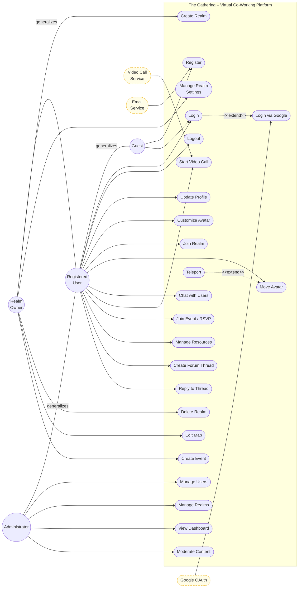

---

## UC-D1 — AUTHENTICATION MANAGEMENT

> Covers all mechanisms by which a user gains or loses access to the platform: OTP registration, email/password login, and Google OAuth.

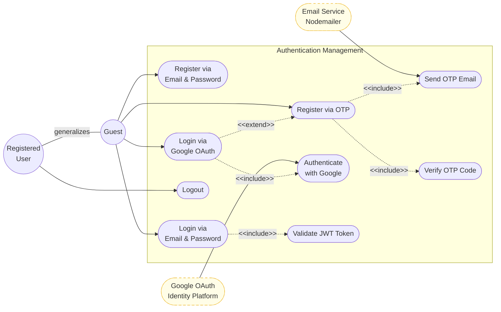

---

## UC-D2 — PROFILE MANAGEMENT

> Covers how a registered user views and modifies their personal profile and in-game avatar configuration.

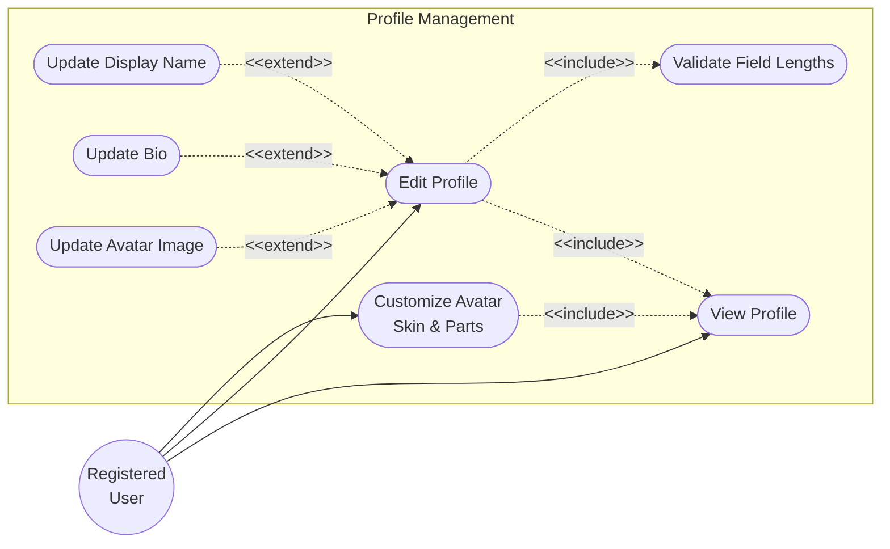

---

## UC-D3 — REALM MANAGEMENT

> Covers the full lifecycle of a virtual workspace: creation, configuration, privacy control, and deletion with cascade.

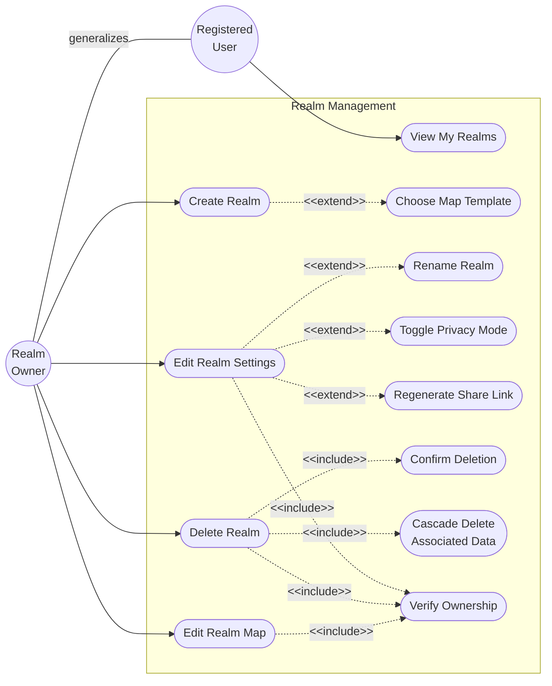

---

## UC-D4 — REAL-TIME INTERACTION

> Covers avatar mechanics inside an active realm session: joining, movement, teleportation, and disconnecting with position saving.

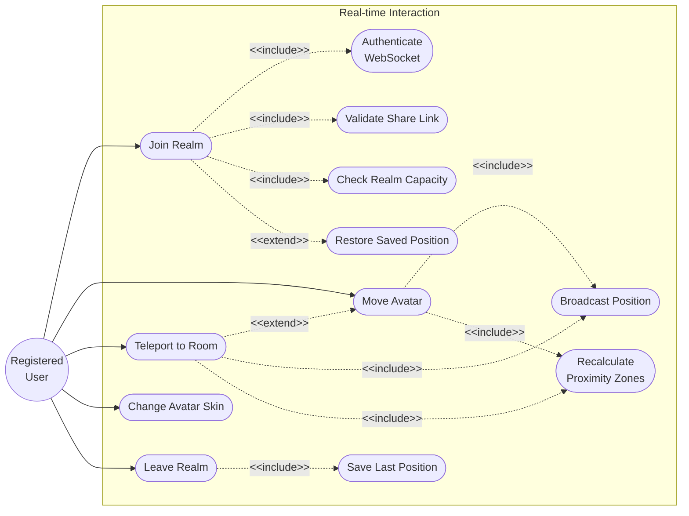

---

## UC-D5 — CHAT SYSTEM

> Covers ephemeral proximity chat (in-realm, not persisted) and persistent channel / direct-message communication.

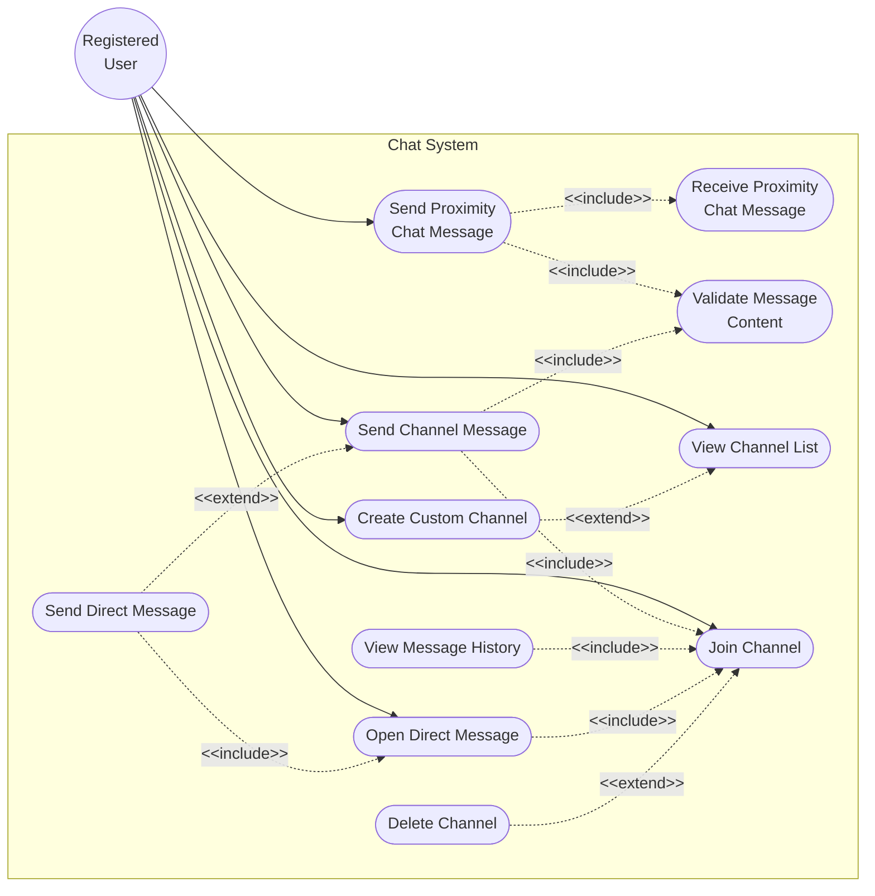

---

## UC-D6 — CALLING SYSTEM

> Covers the WebSocket-based video call signaling flow between two realm participants, with Jitsi for actual media streaming.

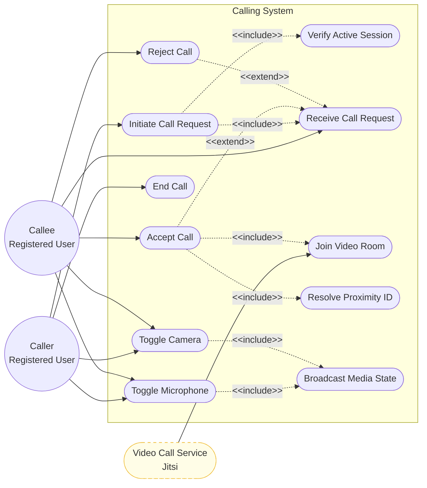

---

## UC-D7 — EVENT MANAGEMENT

> Covers creation, editing, deletion, and RSVP management for calendar events within a realm.

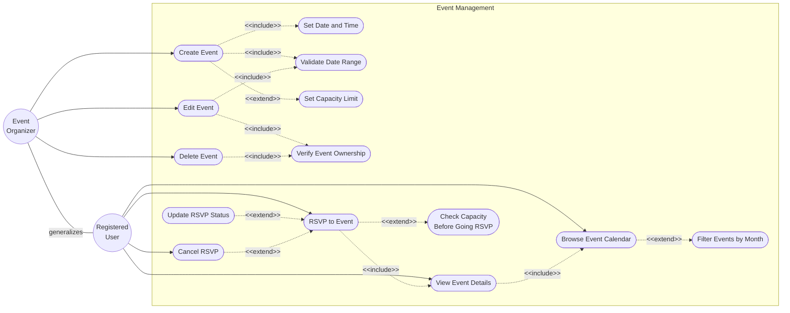

---

## UC-D8 — RESOURCE LIBRARY

> Covers uploading, browsing, searching, and deleting shared resource links within a realm.

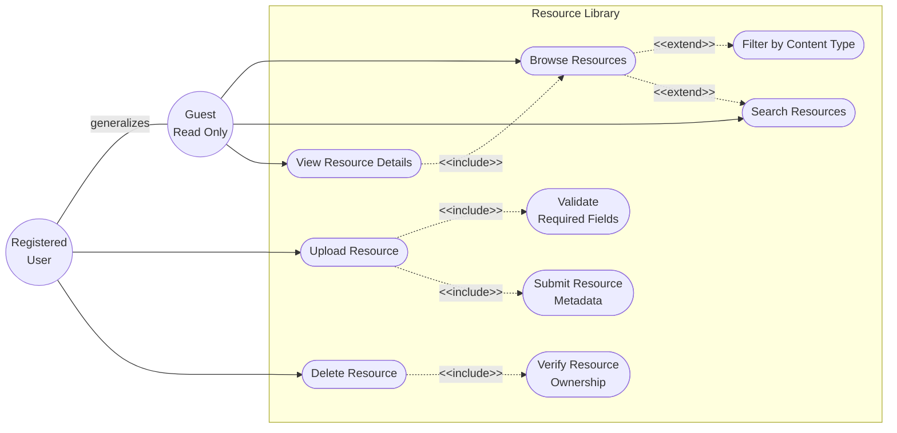

---

## UC-D9 — FORUM

> Covers creating discussion threads, replying with posts, and deleting content within a realm forum.

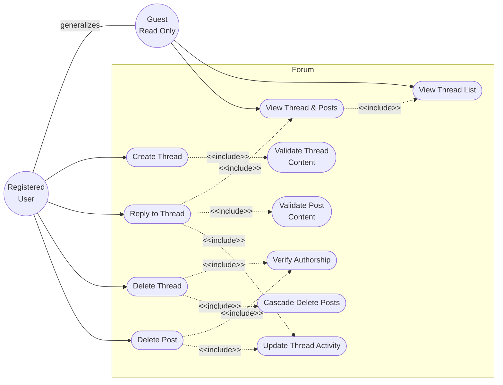

---

## UC-D10 — ADMIN CONSOLE

> Covers the administrator-exclusive panel for user management, realm oversight, content moderation, and analytics.

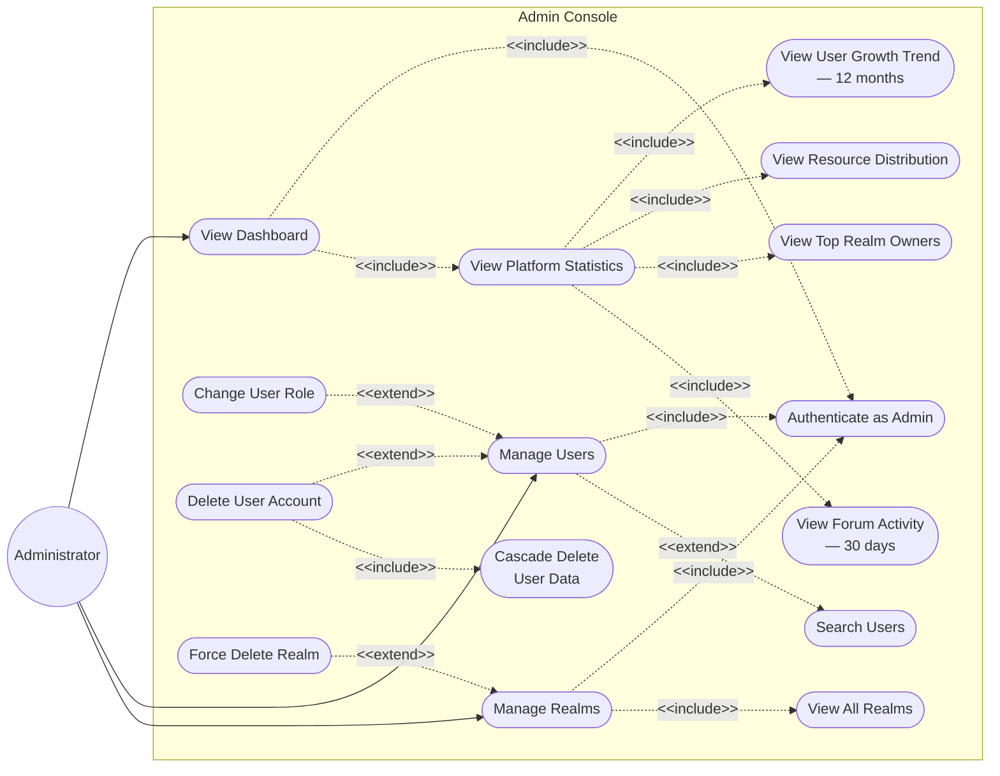

---

## ACTOR GENERALIZATION HIERARCHY

> Shows the inheritance relationships between all system actors. Each child actor inherits all capabilities of the actor above it.

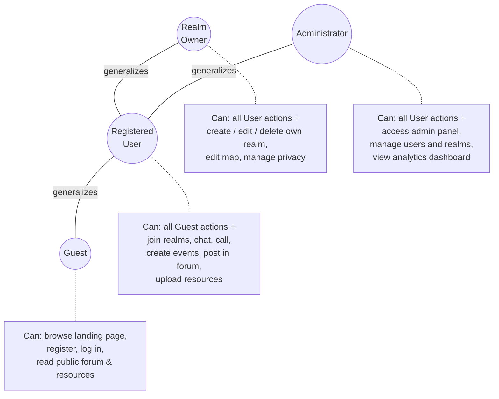

---

## RELATIONSHIP TYPES REFERENCE

| Relationship   | Mermaid Syntax      | Meaning                                      |
| :------------- | :------------------ | :------------------------------------------- | --------- | --------------------------------------------- |
| Association    | `Actor --> UseCase` | Solid arrow — actor participates in use case |
| Include        | `Base -.->          | "&lt;&lt;include&gt;&gt;"                    | Included` | Base **always** calls the included use case   |
| Extend         | `Extending -.->     | "&lt;&lt;extend&gt;&gt;"                     | Base`     | Extending **optionally** augments the base    |
| Generalization | `Child ---          | "generalizes"                                | Parent`   | Child inherits parent's role and capabilities |

### Key Design Decisions

1. **`<<include>>` is used when** a sub-behaviour is _mandatory_ and reusable across multiple base use cases (e.g., every write operation includes `Verify Ownership`; every socket event includes `Validate JWT`).

2. **`<<extend>>` is used when** the extended behaviour is _conditional or optional_ (e.g., `Toggle Privacy Mode` only sometimes applies within `Edit Realm Settings`; `Filter by Month` is optional when browsing events).

3. **Generalization between actors** reflects the actual codebase role model: `role: "user"` vs `role: "admin"`, and the `owner_id` ownership check enforced in realm routes.
