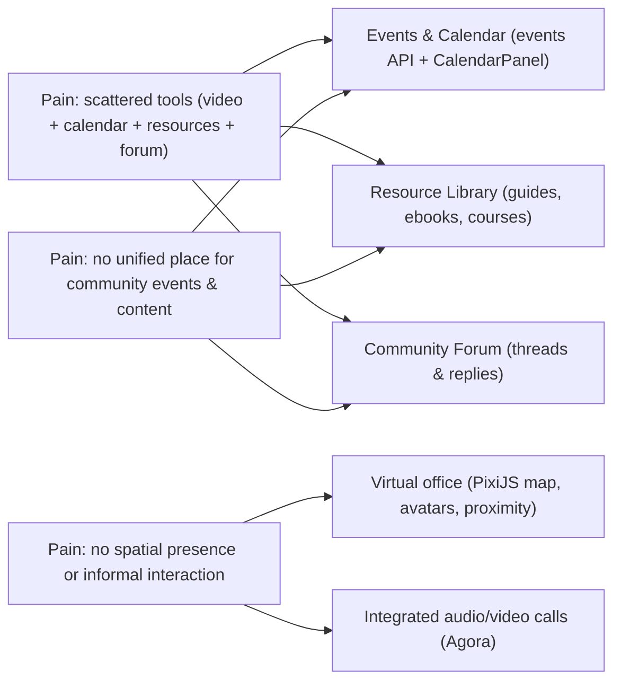

1️⃣ Project Overview
Project Title
**The Gathering – Virtual Co-Working Space Platform**

Project Context & Motivation
Modern collaboration increasingly takes place in remote environments. However, conventional video-conferencing tools lack spatial presence and offer limited support for informal interaction (e.g., hallway conversations, ad-hoc small group discussions).
The original client brief for The Gathering (see `techbrief.md`) also highlights concrete product gaps:

- Users need a web interface with sign-up/login, verification and profile management.
- They need an **Events booking & management** experience with a shared calendar and automated communication.
- They need a **digital public library** for community resources (guides, ebooks, courses).
- They need a **community forum** and (optionally) a **service directory** for services offered by members.

This capstone project addresses these limitations by implementing a web-based virtual collaboration space, where users are represented as avatars navigating a shared 2D environment. Communication is influenced by proximity (nearby chat) and supported by structured channels and scalable voice/video conferencing, Events & Calendar, Resource Library, Forum and (future) Service Directory.

From a software engineering perspective, the project integrates several advanced domains:
Real-time systems: Socket.IO–based presence tracking, chat events, and state synchronization

2D runtime rendering: PixiJS v8 for map rendering, avatar movement, and entity management

Scalable WebRTC: Agora RTC SDK (cloud SFU) for proximity-based and group audio/video calls (≥20 participants)

Security & reliability: JWT-based authentication, rate limiting, input sanitization (Zod), and upload constraints

High-Level Product Vision
The goal is to deliver a demo-ready, professional-grade web application that demonstrates:
A polished, consistent UI (Tailwind CSS v3.4, dark/light theme)

A real-time virtual room with avatar-based spatial interaction

Integrated text, voice, and video communication comparable to Gather Town

System Context Diagram

Note: Socket.IO serves as the primary signaling backbone. Audio/video is handled by Agora RTC SDK (cloud SFU) with proximity-based channel joining.

2️⃣ Purpose & Objectives
Core Purpose
To design and build a web-based virtual collaboration environment that supports:
Spatial presence

Context-aware interaction

Real-time communication (chat + voice/video)

This approach enables more engaging and natural collaboration than traditional video-call-only solutions.

Problem–Solution Overview (from tech brief to implementation):

Specific Objectives (Aligned with the Implemented Codebase)
ID
Objective
Description
Evidence in Repository
OBJ-01
Authentication & sessions
User onboarding via email/password, OTP, Google OAuth
backend/src/routes/auth.ts, models/User.ts
OBJ-02
Room entry & invite
Join rooms and share invite links
routes/realms.ts, InviteModal.tsx
OBJ-03
Spatial presence
Avatar movement in shared 2D map
utils/pixi/PlayApp.ts, Player.ts
OBJ-04
Real-time presence
Online/offline tracking and room member sync
sockets/sockets.ts, PlaySidebar.tsx
OBJ-05
Multi-mode chat
Channels, DM, in-game bubble chat with history
routes/chat.ts, ChatPanel.tsx
OBJ-06
Scalable voice/video
Cloud SFU via Agora RTC SDK (≥20 users)
utils/video-chat/video-chat.ts, GroupCallPanel.tsx
OBJ-07
Media state sync
Mic/cam states and camera bubbles on sprites
Player.ts, PlayNavbar.tsx
OBJ-08
Reliability & anti-abuse
Rate limiting, Zod validation, JWT auth
routes/auth.ts, express-rate-limit
OBJ-09
Events & Calendar
Per-space event creation, RSVP, calendar view
routes/events.ts, CalendarPanel.tsx
OBJ-10
Resource Library
Digital resource management per space
routes/resources.ts, LibraryPanel.tsx
OBJ-11
Community Forum
Thread-based discussions per space
routes/forum.ts, ForumPanel.tsx
OBJ-12
Admin Dashboard
System-wide analytics and management
routes/admin.ts, admin/page.tsx

3️⃣ Scope
In-Scope Features
Area
Included Features
Notes
Frontend
Next.js 14 App Router, Tailwind CSS, React components
app/
Backend
Express.js APIs, MongoDB (Mongoose), security middleware
backend/src/
Real-time layer
Socket.IO for presence, chat, media state signaling
FE ↔ BE
Virtual room
PixiJS v8–based 2D map & animated avatars
utils/pixi/*
Text chat
Channels, DM, in-game bubble messages, typing indicators
Persistent (MongoDB)
Voice/video
Agora RTC SDK (cloud SFU)
Proximity-based + group calls
Map Editor
Tile painting, special tiles, multi-room management
editor/
Admin
Dashboard with charts, user/realm/event/resource management
admin/page.tsx
Events
Calendar, RSVP, per-space events
CalendarPanel.tsx
Library
Resource types: guide, ebook, course, video, audio
LibraryPanel.tsx
Forum
Threads, replies, per-space discussions
ForumPanel.tsx
Invites
Shareable room invite URLs
Implemented

Out-of-Scope Features
Excluded Item
Rationale
Native mobile apps
Web SPA only
VR/AR or 3D world
High complexity, out of scope
MMO-scale rooms
Requires distributed SFU & sharding
Enterprise compliance
Beyond capstone requirements
Full CI/CD & cloud infra
Local demo focus
Automated load testing
Manual testing only
Recording/meeting recap
Future enhancement

4️⃣ Deliverables
Category
Deliverable
Description
Source Code
Frontend
Next.js 14 / React 18 / Tailwind CSS / PixiJS 8
Source Code
Backend
Express.js / MongoDB / Socket.IO / TypeScript
Source Code
Media Integration
Agora RTC SDK wrapper
Database
Schemas
User, Profile, Realm, ChatChannel, ChatMessage, Event, Thread, Post, Resource
Documentation
Tech Stack
techstack.md
Documentation
Coding Rules
rules.md
Documentation
Project Plan
plan.md
Academic
SRS
Requirements specification (SRS.md)
Academic
Project Charter
This document (charter.md)
Demo
Local demo package
.env examples, run scripts, sample data

5️⃣ Stakeholders & Team
Stakeholder
Role
Responsibility / Success Criteria
Supervising Lecturer (Mentor)
Guidance & review
Architectural correctness, technical feedback
Project Leader – Phạm Nguyễn Thiên Lộc
Planning & coordination
Timeline, scope, risk tracking, final presentation lead
Developer – Lê Tấn Đạt
Authentication & avatar customization
Login/OTP/OAuth flows, avatar editor & in-game avatar rendering
Developer – Lê Thới Duy
Events & Calendar
Calendar UI, event CRUD & RSVP, Calendar-related APIs
Developer – Bành Văn Trần Phát
Core platform & remaining features
Realtime movement, chat, video calls, map editor, admin, library, forum, and integration work
Capstone Team (Development Team)
Implementation
Stability & completeness; Frontend, Backend, Realtime
Customer / Product Owner
Requirements representative (if any)
Acceptance criteria, backlog prioritization
End Users
Demo users
Usability & reliability
Evaluation Committee
Assessment
Technical depth & innovation
Maintainer (future)
Maintenance
Code clarity & documentation

**Support resources:** Local server, MongoDB, dev environment (Node.js 20+, Yarn). Agora free tier (10,000 minutes/month) for audio/video.

6️⃣ Approach & Development Methodology
Methodology: **Agile / Scrum**

| Item | Description |
| -------- | ----- |
| Sprint | 2 weeks / sprint |
| Sprint Planning | Start of each sprint: select user stories from backlog, estimate effort, commit scope |
| Daily Scrum | Short standup (15 mins): what was done, what will be done, blockers |
| Sprint Review | End of sprint: demo the increment, gather feedback |
| Sprint Retrospective | Improve the development process, adjust Definition of Done |
| Backlog | GitHub Projects / Kanban; prioritized using MoSCoW |
| Definition of Done | Feature completed + no TypeScript errors + docs updated |

7️⃣ Assumptions, Constraints & Success Criteria
Assumptions
Users have modern browsers supporting WebRTC and Canvas (Chrome/Edge/Firefox)

Local demo environment is available (Node.js 20+, MongoDB)

Small-group, single-region sessions (30 users max per space)

Stable network during demo

Agora free tier sufficient for demo (10,000 min/month)

Constraints
Real-time synchronization complexity (Socket.IO event ordering)

Agora RTC requires valid App ID; free tier has usage limits

Limited capstone timeline (9 weeks)

Baseline (not enterprise-grade) security

PixiJS video rendering requires canvas-based workaround for live MediaStream

Success Criteria
Metric
Target
Functional completeness
Join, move, chat, voice/video, events, library, forum
Voice/video scalability
≥20 users per proximity group
Chat reliability
No message duplication, real-time delivery
UX readiness
Polished UI matching Gather.town aesthetic
Demo stability
Predictable local runtime, no crashes

8️⃣ Key Risks & Mitigations
Risk
Impact
Mitigation
Agora connectivity / quota
High
Testing Mode (no token), monitor usage, fallback to audio-only
PixiJS video stack overflow
High
Canvas-based frame rendering (15fps) instead of PIXI.VideoSource
Socket.IO race conditions
High
Server-authoritative state, Zod validation
Message duplication
Medium
ID-based deduplication, server-side persistence
UI inconsistency
Medium
Shared Tailwind design tokens, component library
Demo-day failure
High
Checklists, fallback plans, local-only demo setup
Browser zoom breaks layout
Medium
Flex-based layout (not fixed positioning)

9️⃣ Governance & Communication Plan
Topic
Plan
Meetings
Weekly planning + mid-week sync
Definition of Done
Feature + TypeScript compile + docs
Decision log
Stored in doc/
Issue tracking
GitHub Projects / Kanban
Reviews
PR review by ≥1 member
Commit convention
Conventional Commits (see rules.md)

🔟 High-Level Timeline
| Phase | Description | Timeframe |
| --------- | ----- | ------- |
| Phase 1 – Foundation | Auth, DB setup, basic map, space CRUD | Sprint 1 (29/02 – 14/03) |
| Phase 2 – Core Real-time | Multiplayer movement, presence, zones | Sprint 2 (15/03 – 28/03) |
| Phase 3 – Communication | Chat, Agora video/audio, proximity calls | Sprint 3 (29/03 – 11/04) |
| Phase 4 – Features & Admin | Events, Library, Forum, Admin, Editor | Sprint 4 (12/04 – 25/04) |
| Phase 5 – Demo Ready | Testing, polish, docs, demo package | Sprint 5 (26/04 – 04/05) |

*Details: see plan.md*

1️⃣1️⃣ Summary
This Project Charter defines the scope, objectives, and governance of a demo-ready virtual collaboration platform built on:
Next.js 14 + React 18 + Tailwind CSS (Frontend),
Express.js + MongoDB + Mongoose (Backend),
Socket.IO (Real-time), and
Agora RTC SDK for scalable cloud-based WebRTC audio/video.
The project prioritizes stability, usability, and demonstrable technical depth, making it suitable for both academic evaluation and real-world inspiration.
