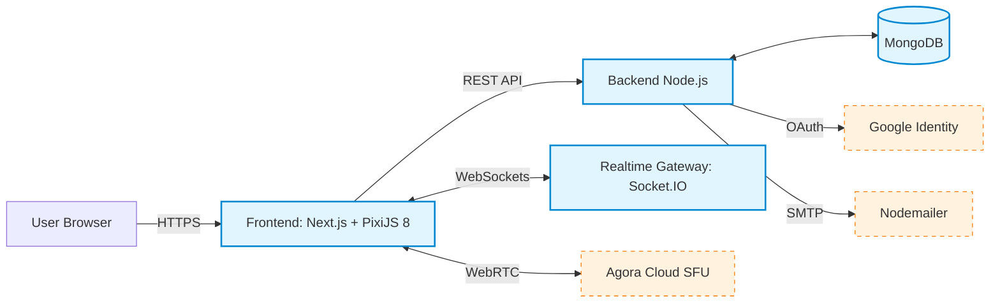
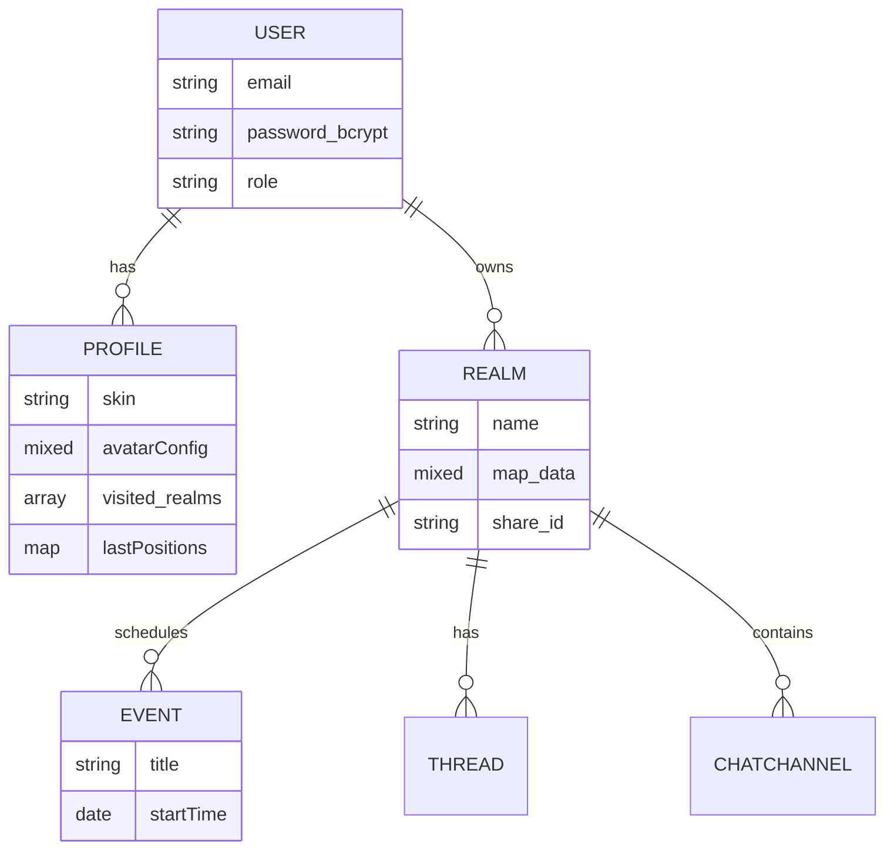
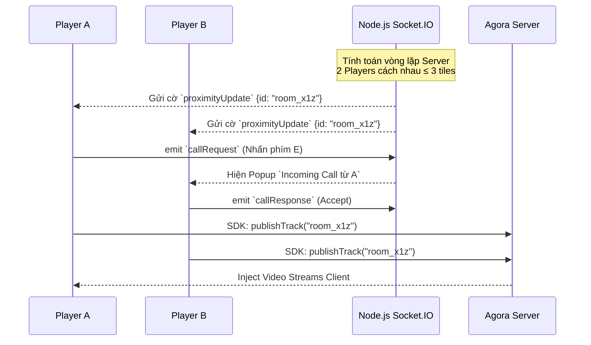

---

# Chapter 3 – Từ Yêu Cầu Khách Hàng đến Thiết Kế Hệ Thống 
> Requirements Engineering & SRS Documentation (Dự án: The Gathering)
> Thời lượng dự kiến: 10 - 15 phút

---

# PHẦN 1: QUY TRÌNH KỸ THUẬT LẤY YÊU CẦU (RE THEORY & PROCESS)

> Từ Nền tảng Lý thuyết đến Ứng dụng thực tiễn vào The Gathering

---

## Slide 1 – Tổng quan về Kỹ thuật Lấy Yêu cầu (Requirements Engineering)

**Nội dung Slide:**

- **Requirements Engineering (RE) là gì?**
  - Quá trình xác định, phân tích, ghi chép, xác minh và quản lý các yêu cầu phần mềm.
  - Là giai đoạn **cốt lõi (SDLC)**: Sai sót ở RE sẽ gây lan truyền lỗi nghiêm trọng ở pha Code & Test.
- **Mục tiêu của RE:**
  1. Đảm bảo phần mềm giải quyết đúng nhu cầu khách hàng.
  2. Chuyển đổi ý tưởng thô thành tài liệu đo lường được.
  3. Tạo nền tảng để Thiết kế kiến trúc (Design) và Kiểm thử (Testing).

**🎤 Speaker Notes (Kịch bản thuyết trình):**

> "Chào thầy và các bạn. Hôm nay nhóm em xin trình bày Chương 3: Kỹ thuật lấy yêu cầu và Đặc tả SRS. Đầu tiên, nhắc lại lý thuyết nền tảng: Requirements Engineering là bước khởi đầu của mọi dự án phần mềm. Tầm quan trọng của nó nằm ở việc nếu ta xác định sai yêu cầu từ đầu, toàn bộ code và design phía sau đều đổ sông đổ biển. Mục tiêu tối thượng của nhóm em ở pha này là biến những ý tưởng mông lung của khách hàng thành một văn bản kỹ thuật chuẩn xác để team Dev có thể code theo."

---

## Slide 2 – 4 Cấp độ Yêu Cầu & 5 Bước Quy trình RE

**Nội dung Slide:**

- **Bốn cấp độ phân loại yêu cầu:**
  1. **Business Req:** Mục tiêu chiến lược của doanh nghiệp.
  2. **User Req:** Mong muốn của người dùng cuối.
  3. **System Req:** Chức năng & rào cản hệ thống.
  4. **Software Req:** Đặc tả kỹ thuật / API chi tiết.
- **Quy trình RE 5 bước chuẩn mực:**
  1. **Elicitation (Thu thập):** Phỏng vấn, mổ xẻ vấn đề.
  2. **Analysis (Phân tích):** Giải quyết mâu thuẫn, vẽ Use Case.
  3. **Specification (Đặc tả):** Ghi chép thành tài liệu SRS (IEEE 830).
  4. **Validation (Thẩm định):** Review cùng khách hàng.
  5. **Management (Quản lý):** Theo dõi thay đổi (Change Request).

**🎤 Speaker Notes (Kịch bản thuyết trình):**

> "Về kỹ thuật, một vòng đời lấy yêu cầu trải qua 5 bước kinh điển: Từ đi thu thập (Elicitation) đến phân tích (Analysis), đặc tả thành văn bản (Specification), tới thẩm định (Validation) và quản lý (Management). Khi phân tích, yêu cầu được chia làm 4 tầng rất chặt chẽ: Business (từ góc độ kinh doanh), User (người dùng muốn gì), System (Hệ thống tổng bối cảnh làm được gì) và cuối cùng là Software Req (Code cụ thể như thế nào)."

---

## Slide 3 – Áp dụng Thực tiễn: Nhận đề bài The Gathering (Elicitation)

**Nội dung Slide:**

- **Bước 1 của quy trình RE (Elicitation):** Lắng nghe và bóc tách mong muốn của khách hàng từ tài liệu thô (Tech Brief).
- **Bài toán tổng quan của The Gathering:** Xây dựng một "Virtual Co-Working Space" (Không gian làm việc chung ảo).
- **Bước 1 của Khai thác yêu cầu (Elicitation):** Lắng nghe và bóc tách mong muốn của khách hàng từ tài liệu thô.
- **Bài toán tổng quan từ Tech Brief:** Xây dựng một "Virtual Co-Working Space" (Không gian làm việc chung ảo) mang tên The Gathering tập trung vào tính tương tác cộng đồng.
- **Các "Key Features" bắt buộc (MVP Requirements):**
  - **Nền tảng tổ chức sự kiện (Event Hosting):** Sức chứa 20-100 người tham gia đồng thời.
  - **Tính năng "Breakout Rooms":** Khả năng chia nhóm thảo luận nhỏ (Private sessions) ngay trong một sự kiện lớn.
  - **Thư viện số (Digital Library):** Nơi lưu trữ, phân phối tài liệu (Guides, E-books, Khóa học).
  - **Diễn đàn cộng đồng (Community Forum):** Nơi người dùng thảo luận, trao đổi qua lại.

**🎤 Speaker Notes (Kịch bản thuyết trình):**

> "Và ngay bây giờ, nhóm xin trình bày cách đưa tệp Lý thuyết vừa rồi vào Thực tiễn dự án The Gathering. Ở bước Elicitation đầu tiên, đề bài của nhóm đến từ một cuốn Tech Brief yêu cầu xây dựng không gian làm việc ảo. Điểm mấu chốt ở đây là hệ thống bắt buộc phải giải quyết được 3 bài toán: Sức chứa lên tới 100 người, có khả năng chia nhóm nhỏ 'Breakout Rooms' dưới dạng Live Video, và tích hợp các công cụ như Thư viện hay Diễn đàn vào một nền tảng duy nhất."

---

## Slide 4 – Áp dụng Analysis: Phân tích Business & User Level

**Nội dung Slide:**

- **Vấn đề cốt lõi (Business Requirement):**
  - Các nền tảng Web-conferencing truyền thống dạng lưới video (e.g. Zoom, Google Meet) đang gây ra hội chứng **"Zoom Fatigue"** (Sự kiệt quệ tâm lý do nhìn vào lưới camera liên tục).
  - Thiếu cơ chế tương tác tự nhiên, bị bó buộc bởi các Room Link nhàm chán, khó tạo ra bầu không khí "Cộng đồng" gắn kết.
- **Nhu cầu người dùng (User Requirement):**
  - Cần một không gian mô phỏng thế giới thực, nơi Avatar của học viên có thể đi dạo, gặp gỡ ngẫu nhiên, tụ tập quanh tài liệu chung.
  - Hỗ trợ tự động kết nối và ngắt kết nối hội thoại một cách mượt mà mà không cần tạo link phòng thủ công.

**🎤 Speaker Notes (Kịch bản thuyết trình):**

> "Bước sang giai đoạn 2 - Analysis (Phân tích cấp độ Business/User). Trăn trở lớn nhất của khách hàng là 'Breakout Rooms', nhưng nếu chúng ta chỉ làm một trang web có các link Zoom thì quá tẻ nhạt, dẫn đến hội chứng 'Zoom Fatigue' (kiệt quệ vì họp online) mà dân văn phòng rất sợ. Do đó, dưới góc độ User Requirement, nhóm định hình: Nền tảng này bắt buộc phải là một không gian số 2D. Avatar phải đi lại, chạm mặt ai thì tự động nói chuyện với người đó y như đời thực, không ai phải xin link phòng."

---

## Slide 5 – Áp dụng Specification: Giải bài toán "Breakout Rooms"

**Nội dung Slide:**

- Thay vì thiết kế giao diện Website truyền thống, nhóm đã đề xuất giải pháp kiến trúc: **2D Spatial Virtual Space (Không gian ảo 2D).**
- Sơ đồ ánh xạ từ Yêu cầu (Tech Brief) sang Kiến trúc thực tế:

```mermaid
flowchart TD
  subgraph Brief[Yêu cầu gốc từ Tech Brief]
    R1[Event Hosting (20-100 pax)]
    R2[Tính năng Breakout "Rooms"]
    R3[Diễn đàn & Thư viện số]
  end

  subgraph Solution[Kiến trúc hệ thống The Gathering]
    S1(Tích hợp Game Engine PixiJS<br/>Vẽ Map 2D, điều khiển Avatar)
    S2(Tích hợp Cloud SFU Agora<br/>Tự động bật Camera khi Spatial Proximity < 3)
    S3(Tương tác Object-based<br/>Gắn UI React vào Tủ sách/Bảng tin trên Map)
  end

  R1 --> S2
  R2 -->|User tự di chuyển ra xa để tách nhóm (Không cần link)| S1
  R2 -->|Tự động kết nối/ngắt kênh âm thanh dựa trên tọa độ| S2
  R3 -->|Người dùng 'Bấm phím X' vào vật thể để mở giao diện Web| S3

  classDef req fill:#f9f2f4,stroke:#d04437,stroke-width:2px;
  classDef sol fill:#e1f5fe,stroke:#0288d1,stroke-width:2px;
  class R1,R2,R3 req;
  class S1,S2,S3 sol;
```

**🎤 Speaker Notes (Kịch bản thuyết trình):**

> "Slide này thể hiện kỹ năng Specification. Từ yêu cầu Breakout Rooms khô khan, nhóm giải mã bằng Game Engine 2D PixiJS. Người dùng chỉ cần cầm phím mũi tên đi ra góc bản đồ cùng nhau. Nếu tính năng Spatial Proximity đo khoảng cách dưới 3 block lưới, camera tự động bật qua Cloud Agora, tạo thành một nhóm thảo luận (breakout) ngay trong event lớn. Thư viện hay diễn đàn đều biến thành các vật thể Tủ sách, Bảng thông báo trên Map để avatar tương tác trực quan."

---

## Slide 6 – Áp dụng Validation: Kiểm chứng yêu cầu với Stakeholders

**Nội dung Slide:**

- **Mục tiêu của Validation:** Xác nhận tài liệu SRS phản ánh đúng mong muốn ban đầu từ Tech Brief và các tình huống sử dụng thực tế.
- **Cách nhóm thực hiện Validation:**
  1. Review chéo giữa BA - Dev - QA trên từng nhóm yêu cầu (Auth, Realm, Realtime, Chat, Event, Forum).
  2. Đối chiếu Use Case và User Story với kịch bản nghiệp vụ chính (đăng nhập, vào realm, tương tác proximity, tạo sự kiện).
  3. Xác minh tiêu chí chấp nhận (Acceptance Criteria) có thể kiểm thử được.
- **Kết quả Validation:**
  - Loại bỏ các yêu cầu mơ hồ, tránh mô tả chung chung không triển khai được.
  - Chốt bộ yêu cầu cốt lõi phục vụ triển khai Mid-term.

**🎤 Speaker Notes (Kịch bản thuyết trình):**

> "Sau khi đặc tả xong, nhóm không nhảy vào code ngay mà làm bước Validation. Nghĩa là tài liệu phải được kiểm chứng lại với stakeholder và chính team kỹ thuật: yêu cầu có rõ không, có test được không, có mâu thuẫn giữa các module không. Nhờ bước này, nhóm loại bớt các ý tưởng mơ hồ và chốt được bộ yêu cầu có thể triển khai thực tế cho mốc giữa kỳ."

---

## Slide 7 – Áp dụng Management: Quản lý thay đổi yêu cầu (Change Management)

**Nội dung Slide:**

- **Mục tiêu của Management:** Kiểm soát vòng đời yêu cầu khi dự án thay đổi theo Sprint.
- **Cơ chế quản lý nhóm áp dụng:**
  1. Thiết lập baseline tài liệu (`SRS.md`, `RTM.md`, `User_Story.md`) làm mốc kiểm soát.
  2. Mọi thay đổi đi qua dạng **Change Request** và được đánh giá tác động đến kiến trúc, tiến độ, test cases.
  3. Dùng **RTM (Requirement Traceability Matrix)** để truy vết từ yêu cầu -> module code -> test.
- **Giá trị mang lại:**
  - Hạn chế trượt phạm vi (scope creep).
  - Đảm bảo mọi chỉnh sửa đều có lý do, có bằng chứng, có kiểm thử đi kèm.

**🎤 Speaker Notes (Kịch bản thuyết trình):**

> "Bước cuối cùng là Management - quản lý thay đổi yêu cầu. Trong dự án thật, yêu cầu luôn đổi theo thời gian, nên nhóm phải có baseline và cơ chế Change Request. Mỗi thay đổi đều truy được bằng RTM: đổi yêu cầu nào thì ảnh hưởng module nào, test case nào. Nhờ vậy nhóm kiểm soát được phạm vi và không bị vỡ kế hoạch sprint."

> "Khi đã khép đủ 5 bước RE như vậy, nhóm mới chuyển sang phần SRS để chuẩn hóa toàn bộ yêu cầu thành tài liệu kỹ thuật có thể triển khai và kiểm thử."

---

# PHẦN 2: TÀI LIỆU YÊU CẦU PHẦN MỀM (SRS DOCUMENTATION)

> Cấu trúc IEEE 830 và Chuẩn hóa Kiến trúc The Gathering

---

## Slide 8 – Cấu trúc IEEE 830 & Ranh giới Hệ thống (System Context)

**Nội dung Slide:**

- **Cấu trúc SRS chuẩn IEEE 830 nhóm áp dụng:**
  1. Intro (Mục đích, Phạm vi).
  2. Overall Description (Bối cảnh hệ thống).
  3. Specific Requirements (FR, NFR, External Interfaces).
- Sơ đồ ranh giới hệ thống phân bổ luồng dữ liệu 2 chiều (System Context):
  - **Khối Backend tĩnh:** Lưu trữ dữ liệu.
  - **Khối Realtime:** Tách biệt gánh nặng Multimedia ra khỏi Server HTTP truyền thống.



**🎤 Speaker Notes (Kịch bản thuyết trình):**

> "Bước vào phần viết Đặc tả SRS theo chuẩn quốc tế IEEE 830. Nhóm đã chia tài liệu dọc theo 3 phần: Giới thiệu, Bối cảnh và Yêu cầu cụ thể. Trên slide là Sơ đồ System Context (mục Overall Description). Ở đây, Frontend Next.js và game engine PixiJS giao tiếp song song với 3 luồng: Luồng API tĩnh lên Node.js, luồng Socket định tuyến tọa độ người chơi, và mạng Media WebRTC bắn trực tiếp video lên đám mây Agora. Việc rạch ròi luồng dữ liệu thế này sẽ cứu hệ thống khỏi bị quá tải."

---

## Slide 9 – Mô Hình Use Case Cốt Lõi (Actor Actions)

**Nội dung Slide:**
Xác định 3 phân quyền (Actors) chính tương tác trên bề mặt The Gathering:

```mermaid
flowchart TB
  User((User / Guest))
  Owner((Realm Owner))
  SAdmin((System Admin))

  subgraph TheGathering[Hệ sinh thái The Gathering]
    UC1[Đăng nhập Auth & OAuth]
    UC2[Di chuyển 2D & Proximity Media]
    UC3[Dùng Chat DM / Bubble Realtime]
    UC5[Cài đặt Event Calendar & Kho tài nguyên]
    UC6[Thiết kế Map (Map Editor)]
    UC10[Trang Dashboard Thống Kê Tổng]
  end

  User --> UC1
  User -->|Core Action| UC2
  User --> UC3
  Owner --> UC5
  Owner -->|Nâng cao| UC6
  SAdmin -->|Quản lý hệ thống| UC10
```

**🎤 Speaker Notes (Kịch bản thuyết trình):**

> "Kế tiếp, nhóm họa sơ đồ Use Case. Nhóm chia hệ thống làm 3 tệp Actor. User thông thường (Khách mời) sẽ chỉ tập trung vào Core Action là di chuyển 2D, gọi Video proximity và chat. Realm Owner (Chủ phòng, host sự kiện) sẽ được cấp siêu quyền như Map Editor để tự dùng chuột vẽ tường ngăn không gian. Và cuối cùng là nhóm quản trị System Admin có Dashboard tách biệt hoàn toàn để giám sát. Cấu trúc này bám siêu sát với Use Case ban đầu của Tech Brief về phân quyền người dùng."

---

## Slide 10 – Đặc tả Yêu Cầu Chức Năng Cụ Thể (Functional Requirements - FR)

**Nội dung Slide:**
Tài liệu SRS chuẩn IEEE 830 định nghĩa hệ thống **"Phải làm được gì"**.

- **FR-MAP (Vận hành bản đồ 2D):**
  - **Hệ thống:** Parse/Đọc dữ liệu Tiled JSON thành các layer bản đồ. Cấm di chuyển khi va chạm tường (Collision Matrix Logic).
- **FR-RTC (Truyền thông Đa phương tiện):**
  - Tự động khởi tạo kết nối vào kênh Agora WebRTC khi 2 Avatar vi phạm ngưỡng Proximity (Khoảng cách < 3 tiles).
- **FR-CHAT (Hệ thống tin nhắn Socket):**
  - Giao tiếp Real-time đa kênh: Chat rạp hát (Global), Chat nhóm gần, và hiển thị "Bubble Chat" lơ lửng trên đầu Avatar.
- **FR-EDT (Công cụ Tự xây phòng - Map Editor):**
  - Realm Owner được cấp giao diện kéo/thả để lát gạch sàn, đặt chướng ngại vật ngay trên web.

**🎤 Speaker Notes (Kịch bản thuyết trình):**

> "Phần lõi của tài liệu SRS là Đặc tả Yêu cầu cụ thể. Về mặt FR (Hệ thống phải làm được gì), nhóm quy định rõ: FR-MAP yêu cầu hệ thống đọc được ma trận Tiled JSON để vẽ bản đồ và ngặn chặn đi xuyên tường (Collision Logic). FR-RTC là luật bắt buộc tính toán khoảng cách nhỏ hơn 3 block để tự kích hoạt Video. Nhóm cũng viết rõ rule cho hệ thống Chat bong bóng nổi lên đầu nhân vật, cực kỳ chi tiết cho đội dev implementation."

---

## Slide 11 – Đặc tả Yêu Cầu Phi Chức Năng (Non-Functional Requirements - NFR)

**Nội dung Slide:**
Một SRS tốt không chỉ có tính năng, mà phải ép ràng buộc **"Hoạt động tốt như thế nào"**. Các giới hạn hệ thống của The Gathering:

- **NFR-PERF (Hiệu năng Rendering hình ảnh):**
  - PixiJS thuần túy xử lý đồ họa, không sinh ra để chạy Streaming Video.
  - _Ràng buộc:_ Dùng kỹ thuật _Off-screen Canvas Frame Extraction_ ép thẻ video HTML5 thành Texture WebGL ở **15 FPS**.
- **NFR-NET (Độ ổn định Mạng/Server):**
  - Sự di chuyển Avatar xảy ra vài chục lần mỗi giây.
  - _Ràng buộc:_ Client phải áp dụng **Throttling/Debounce** gói Upload tọa độ lên Socket.IO mỗi 100ms.
- **NFR-SCA (Chịu tải Hệ thống):**
  - Giữ ổn định độ trễ cho Map (Realm) chứa tối đa **30 users** phát Video đồng thời (Phụ thuộc cấu trúc Cloud SFU).
- **NFR-SEC (Bảo mật Tích hợp):**
  - Dữ liệu request body bắt buộc đi qua tầng **Zod** Validation trước khi chạm xuống DB.

**🎤 Speaker Notes (Kịch bản thuyết trình):**

> "Kẻ thù lớn nhất làm sập hệ thống luôn nằm ở giới hạn Phi chức năng (NFR - Hệ thống hoạt động tốt đến mức nào). Ví dụ NFR-PERF: Nhúng Video luồng trực tiếp vào Game cực kỳ ngốn RAM, nhóm phải quy định ép thuật toán Canvas ẩn kéo 15 FPS. Hay NFR-NET: Nếu 30 người cùng nhấn đi lại sẽ sinh hàng vạn events/giây, nhóm đề ra luật Throttling (chặn nhịp) chỉ gửi tín hiệu mỗi 100 milliseconds. Ràng buộc các Rule cực đoan này trong SRS đã cứu toàn bộ Database của dự án khỏi sự cố nghẽn cổ chai!"

---

## Slide 12 – Tầm quan trọng: Mối liên hệ SRS đến SDLC

**Nội dung Slide:**
Yêu cầu định hình Database và Lựa chọn Công nghệ Thiết kế:

- **Ảnh hưởng đến Database Design (Từ FR):**
  - Tính năng di chuyển Grid 2D và va chạm tường (Collision) -> Không thể dùng SQL thuần túy lưu trữ Map.
  - Quyết định dùng **MongoDB** để đúc toàn bộ các lớp (Layers) bản đồ lưu dưới dạng Array 2D JSON (Big Matrix).
- **Ảnh hưởng đến Tech Stack (Từ NFR):**
  - Yêu cầu chịu tải 30 luồng video / phòng -> Mô hình WebRTC Peer-to-Peer truyền thống sẽ sập mạng.
  - Quyết định dùng **Cloud SFU (Selective Forwarding Unit) của Agora** để xử lý phân luồng băng thông trên hệ thống viễn thông lớn.

**🎤 Speaker Notes (Kịch bản thuyết trình):**

> "Kết thúc phần RE và viết SRS, kiến thức chuyên ngành khẳng định: Mọi pha Build Code phía sau (SDLC) đều là hệ quả của Requirement. Ở dự án này, yêu cầu lưu trữ hàng vạn ô vuông bản đồ 2D đã định hướng nhóm loại bỏ SQL truyền thống, chọn NoSQL MongoDB để lưu dưới dạng ma trận mảng siêu lớn. Yêu cầu tải 30 videos sát nhau buộc nhóm lật đổ công nghệ P2P thường bóp méo băng thông, để chuyển sang vung tiền xài nền tảng đám mây lớn Agora SFU. SRS chuẩn sẽ dẫn ra System Architecture chuẩn xác."

---

# PHẦN 3: KẾT QUẢ ĐẠT ĐƯỢC VÀ KẾ HOẠCH TƯƠNG LAI

> Ứng dụng vòng lặp Agile (Sprint Planning) vào The Gathering

---

## Slide 13 – Project Status: Báo cáo Tiến độ Giữa Kỳ (Mid-Term Review)

**Nội dung Slide:**
Tiến độ bám sát quy trình Phát triển phần mềm linh hoạt (Agile):

- **Completed Functionalities (Kết quả đạt được tính đến Mid-term):**
  - **System Foundation (Core Backend):** Gốc dự án Next.js (App Router), Node/Express API, MongoDB và Socket.IO Server.
  - **Authentication & Security:** Luồng đăng nhập JWT, tích hợp Google Identity (OAuth), OTP Email.
  - **Core Game Engine (Trái tim dự án):**
    - Vẽ map 2D bằng PixiJS, Grid-based pathing (di chuyển ô vuông).
    - Logic va chạm vật lý phần cứng (Matrix Collision).
  - **Chat System:** Hệ thống nhắn tin Real-time và logic "Bubble Chat".
  - **Map Editor:** Công cụ tự thiết kế không gian cho Chủ phòng hoàn chỉnh (Hoàn thành sớm).

**🎤 Speaker Notes (Kịch bản thuyết trình):**

> "Sau nỗ lực quy hoạch chuẩn chỉ, đây là tiến độ thực tiễn của giai đoạn Mid-term (Báo cáo giữa kỳ). Bọn em đã dựng xong Base Engine khó nhất. Đăng nhập JWT/OAuth xong, Game di chuyển không đâm xuyên tường đã xong, Khung chat 2D Bubble Chat mượt mà. Đáng tự hào nhất là nhóm đã phát triển thành công module nâng cao "Map Editor" dành cho Manager có thể dùng chuột quy hoạch, lát gạch sàn của chính bản đồ mà không cần lập trình viên can thiệp trực tiếp mã nguồn."

---

## Slide 14 – Future Plan: Kế hoạch Bảo vệ Cuối Kỳ (Final Defense 04/05)

**Nội dung Slide:**
Giai đoạn hai (Sprint 4-5) sẽ đi sâu vào Audio/Video và Module mở rộng:

- **Target Objectives (Mục tiêu cuối kỳ):**
  - **Advanced Communications (Tích hợp Camera Không Gian):**
    - Triển khai Agora SDK cho Proximity Video/Audio interactions.
    - Thuật toán Canvas Extractor để gắn Video trôi dọc theo Bubble Sprite.
  - **Social/Interactive Modules:**
    - Mượn sách, Chia sẻ file (Tủ sách Library Object).
    - Forum cộng đồng và bảng điều khiển Lịch cá nhân (Event Calendar).
  - **Optimization & Stress Testing:** Refactoring cấu trúc, Tinh chỉnh Game Loop FPS và Test tải thật mạng Socket.

**🎤 Speaker Notes (Kịch bản thuyết trình):**

> "Lộ trình hướng tới Final Defense, nhóm sẽ dồn toàn bộ nguồn lực vào mảnh ghép 'sát thủ' cuối cùng: Cấy camera không gian (Proximity Call). Ghép trực tiếp webcam vào từng Sprite hoạt hình khi hai người đứng sát bên nhau. Đồng thời lấp đầy luồng nghiệp vụ tương tác bằng cách cho user click vô cái tủ để mượn sách. Toàn bộ tiến trình phát triển đó đều được kiểm soát gắt gao. Cảm ơn thầy cô và các bạn đã lắng nghe!"

---

# PHẦN QA: BACKUP SLIDES DÀNH CHO TRẢ LỜI CÂU HỎI

> Sơ đồ kỹ thuật sâu để chứng minh năng lực nhóm (Luôn thủ sẵn)

---

## Slide 15 – Q&A Backup: Database ERD Diagram (Dành cho trả lời câu hỏi)

**Nội dung Slide:**
Mô hình thực thể quan hệ giữa các Collection cốt lõi trong MongoDB.



**🎤 Speaker Notes (Chỉ đọc nếu bị Ban Giám Khảo hỏi về CSDL):**

> "Thưa thầy, hệ thống database MongoDB của nhóm em rẽ nhánh từ Cụm USER và PROFILE. Một bản ghi USER chỉ lưu tài khoản siêu gọn, trong khi PROFILE sẽ gánh toàn bộ file cấu hình về Sprite, trang phục (AvatarConfig) và lưu trí nhớ vị trí đứng cuối cùng (LastPositions) ở từng bản đồ. Realm (Bản đồ không gian) là trung tâm, từ Realm sẽ có quan hệ 1-Nhiều thả nhánh xuống Lịch Sự kiện, Diễn đàn, Thư viện và các kênh Chat riêng rẽ."

---

## Slide 16 – Q&A Backup: Proximity Video Call Sequence (Dành cho trả lời câu hỏi)

**Nội dung Slide:**
Thuật toán phân giải Khoảng Cách và Khởi tạo Phòng Video Động (Dynamic Agora Channel).



**🎤 Speaker Notes (Chỉ đọc nếu bị Ban Giám Khảo hỏi về Thuật toán Gọi Video):**

> "Thưa thầy, quy trình Call Video không tuân theo cách gọi Room thông thường. Thay vào đó, em thiết lập một vòng game loop trên Server Node.js Socket.io. Server liên tục đo khoảng cách Euclid của toàn bộ lượng User trên bản đồ. Hễ thấy ai cách nhau dưới 3 Tiles, nó sẽ tự động tống chung 1 mã gọi là `ProximityID` về cho 2 người (room_x1z). Bất cứ ai nhấn nút Kích hoạt 'Phím E', Server sẽ văng tín hiệu mời đến thiết bị đích. Sau khi bên kia 'Accept', cả 2 Client sẽ chủ động cắm Video Track của mình đẩy thẳng lên Server chịu tải của Agora Cloud."
